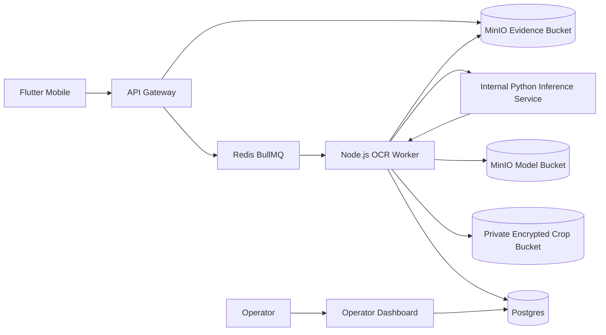

# PLAN.md

## 1. Project Overview

- **Product name:** Sentra Plate OCR Pipeline — Monitoring Angkot Bogor.
- **What we are building:** Pipeline OCR plat nomor untuk membantu verifikasi laporan warga pada aplikasi mobile Sentra Monitoring Angkot. Pipeline terdiri dari detector plat, recognizer karakter, evaluasi end-to-end, dan worker async yang menyimpan hasil ke Postgres/MinIO untuk operator review.
- **Target users:**
  - Warga pengguna aplikasi mobile yang mengirim foto bukti laporan.
  - Operator Dishub yang meninjau hasil OCR sebagai evidence tambahan.
  - Analis/engineer ML yang melatih dan mengevaluasi model.
  - Tim platform yang mengoperasikan worker, MinIO, Redis/BullMQ, dan monitoring.
- **Main problem solved:** Mengurangi beban operator saat memverifikasi plat dari foto laporan warga, tanpa menjadikan OCR sebagai dasar sanksi otomatis.
- **Core value proposition:** OCR lokal/asynchronous memberi kandidat plat dan confidence agar laporan dapat diprioritaskan, tetapi hasil low-confidence atau ambiguous tetap masuk `NEEDS_OPERATOR_REVIEW`.
- **Source documents used:**
  - Project memory Senior Engineer Workflow.
  - `docs/superpowers/specs/2026-05-31-public-report-local-ocr-design.md`.
  - `docs/16-public-report-and-passenger-mobile.md`.
  - `docs/01-system-architecture.md`.
  - `docs/API.md`.
  - `infra/docker-compose/docker-compose.yml`.
  - User request OCR pipeline requirements.

## 2. Requirements Summary

### 2.1 Functional Requirements

- Menggunakan **dua model terpisah**:
  - Detector: YOLOv8 untuk menemukan bounding box plat dari foto kendaraan utuh.
  - Recognizer: PaddleOCR untuk membaca karakter dari crop plat.
- Pipeline deteksi dan recognisi harus dipisahkan agar tuning, metrics, retraining, dan failure analysis dapat dilakukan independen.
- Dataset baseline final memakai dataset publik `linkgish/indonesian-plate-number-from-multi-sources`; dataset lain hanya boleh dipakai sebagai pembanding setelah converter dan audit label jelas.
- Format dataset minimal: gambar kendaraan, bounding box plat, dan label karakter plat.
- Final validation harus menambahkan foto angkot Bogor nyata sekitar 100–200 foto sebagai held-out test set.
- Training detector dan recognizer harus berjalan dalam Docker agar reproducible.
- Model artifact dan metrics tidak disimpan di Git; disimpan di S3/MinIO bucket.
- Inference berjalan asynchronous melalui Node.js worker + BullMQ + Redis.
- Node.js worker mengorkestrasi queue dan memanggil internal Python inference service untuk detect + recognize; tidak memakai Python subprocess.
- Foto evidence di-upload ke MinIO, job OCR di-enqueue, worker membaca file, memanggil Python inference service, lalu menyimpan hasil ke Postgres.
- Hasil OCR meliputi: detected bounding box, normalized plate text, confidence, latency per stage, model version, dan review decision.
- Jika confidence kurang dari threshold, kandidat kosong, atau hasil ambigu, status harus `NEEDS_OPERATOR_REVIEW`.
- OCR hanya evidence operator, tidak otomatis mengubah `plate_match_status`, membuat incident, membuat keputusan enforcement, atau memicu sanksi.

### 2.2 Non-Functional Requirements

- **Security:**
  - Foto tidak dikirim ke OCR SaaS eksternal.
  - Attachment tetap diakses melalui API gateway dengan role internal.
  - Bucket model/image tidak boleh publik.
  - Secret MinIO/S3, Redis, dan DB tidak boleh masuk Git.
- **Performance:**
  - Target detection recall `>= 98%`.
  - Target exact plate match baseline `>= 90%`.
  - False confident match `< 1%`.
  - Ukur latency P50/P95/P99 untuk detection, recognition, dan total pipeline.
- **Scalability:**
  - Worker OCR harus horizontal scalable via BullMQ concurrency.
  - Job retry dan backoff wajib untuk kegagalan transient MinIO/worker.
- **Availability:**
  - Submit report mobile tidak boleh menunggu OCR selesai.
  - Jika enqueue OCR gagal, upload report tetap sukses dan bisa diproses ulang.
- **Maintainability:**
  - Dataset audit, split, training, evaluation, dan inference harus berupa script yang deterministic dan terdokumentasi.
  - Model version dan metrics harus traceable.
- **Compliance/privacy:**
  - Foto warga/angkot adalah evidence sensitif; retensi mengikuti kebijakan Dishub.
  - Dataset angkot Bogor nyata wajib mendapat persetujuan Dishub dan legal review.
  - EXIF dan metadata sensitif harus dihapus sebelum foto masuk dataset/evaluation.
  - Dataset, crop, dan evidence sensitif tidak boleh disimpan di Git.
  - Crop plat hanya disimpan untuk `NEEDS_OPERATOR_REVIEW`, `OCR_MISMATCHED`, dan sampling audit di private encrypted bucket dengan auto-retention.
  - OCR tidak boleh menjadi satu-satunya dasar enforcement.

### 2.3 User Roles and Permissions

| Role | Capabilities | Restrictions |
| --- | --- | --- |
| Public User | Upload report dan foto evidence melalui mobile app | Tidak melihat raw OCR internal/model confidence detail |
| Operator | Melihat foto, kandidat OCR, confidence, dan status review | Tidak mengubah model/training artifact |
| ANALISA | Melihat metrics aggregate, drift, confusion matrix, dan review patterns | Tidak mengakses secret object storage |
| ML Engineer | Menjalankan dataset audit, training, evaluation, upload model artifact | Tidak memproses data produksi tanpa approval/privacy policy |
| Platform/Admin | Mengelola worker, queue, MinIO bucket, env, dan deployment | Tidak mengubah hasil review operator tanpa audit trail |

### 2.4 User Flows

- **Main flow:**
  1. User mobile submit laporan dengan `plate_no`, lokasi, deskripsi, dan foto.
  2. API Gateway menyimpan attachment ke MinIO dan metadata ke Postgres.
  3. API Gateway enqueue job OCR ke BullMQ.
  4. Node.js OCR Worker mengambil job, membaca attachment dari MinIO, lalu memanggil internal Python inference service untuk menjalankan YOLOv8 detector, crop plat, dan PaddleOCR recognizer.
  5. Worker menyimpan hasil OCR dan metrics latency/confidence ke Postgres.
  6. Operator melihat hasil di dashboard report detail dan memutuskan tindakan.

- **Alternative flow:**
  - Jika detector menemukan beberapa plat, worker memilih kandidat confidence tertinggi tetapi menandai ambiguity untuk review.
  - Jika input manual warga berbeda dengan OCR high-confidence, status menjadi `OCR_MISMATCHED` atau `NEEDS_OPERATOR_REVIEW` sesuai policy.

- **Error/empty state flow:**
  - Foto tidak bisa dibaca: `FAILED` + `NEEDS_OPERATOR_REVIEW`.
  - Confidence rendah: `NEEDS_OPERATOR_REVIEW`.
  - Queue/MinIO transient error: retry dengan exponential backoff.
  - Worker down: job tetap pending di BullMQ dan tidak memblokir report submission.

## 3. Tech Stack Decisions

| Area | Decision | Rationale | Alternatives considered |
| --- | --- | --- | --- |
| Detector training | Python 3.11 + PyTorch + Ultralytics YOLOv8 | Mature, cepat untuk object detection, mudah export weights | YOLOv5, Detectron2 |
| Recognizer training | PaddleOCR | Mature OCR toolkit, mendukung custom dictionary dan sequence metrics | CRNN custom, Tesseract baseline |
| Worker runtime | Node.js service + BullMQ orchestrator + internal Python inference service | Node.js tetap selaras dengan backend/queue existing, sementara Python service menangani model inference tanpa subprocess fragile | Python worker full-stack; Node subprocess bridge ditolak karena lebih sulit diobservasi dan dioperasikan |
| Queue | BullMQ + Redis | Sudah digunakan dalam backend pattern existing | NATS/Kafka; belum diperlukan |
| Object storage | MinIO/S3 | Existing storage untuk evidence, cocok untuk model artifacts dan metrics | Local filesystem; tidak production-ready |
| Database | PostgreSQL | Existing operational DB dan review evidence | Separate ML metadata DB; belum diperlukan |
| Containerization | Docker + docker-compose | Reproducible training/eval/local worker | Native local environment; rawan drift |
| Monitoring | Prometheus-style metrics/logging + DB metrics snapshots | Dibutuhkan untuk latency, drift, error rate | Manual log only; tidak cukup production-ready |
| UI | Existing Next.js operator dashboard | Menampilkan OCR evidence di report detail | Separate ML dashboard; belum MVP |
| Mobile | Existing Flutter mobile app | Upload report/evidence existing flow | OCR di device; ditolak untuk MVP karena model/storage/update complexity |

## 4. Architecture Overview

### High-level architecture



### Frontend structure

- Mobile tetap hanya upload report dan foto evidence.
- Operator dashboard menampilkan:
  - crop/box plat hanya jika disimpan untuk `NEEDS_OPERATOR_REVIEW`, `OCR_MISMATCHED`, atau sampling audit,
  - raw OCR text,
  - normalized plate candidate,
  - confidence,
  - comparison result,
  - operator-facing audit metadata terbatas pada `model_version`, `confidence`, dan `timestamp`,
  - `NEEDS_OPERATOR_REVIEW` badge.

### Backend/API structure

- API Gateway menerima report dan attachment.
- API Gateway enqueue job OCR setelah attachment metadata tersimpan.
- Node.js OCR Worker service terpisah mengambil job BullMQ dan memanggil internal Python inference service untuk detect + recognize.
- API endpoint operator membaca hasil OCR dari DB.

### Database/data model overview

- Existing: `public_reports`, `public_report_attachments`, `public_report_reviews`.
- New/Inferred: `public_report_ocr_results`, `ocr_jobs`, `ocr_model_versions`, `ocr_evaluation_runs`.

### Authentication and authorization flow

- Public user auth wajib untuk submit report.
- Operator/ANALISA auth wajib untuk melihat attachment dan hasil OCR.
- Worker memakai internal service credential/env, bukan public JWT.

### External integrations

- MinIO/S3 for evidence, models, metrics.
- Redis/BullMQ for async jobs.
- No external OCR SaaS in MVP.

### File/folder structure proposal

```text
ml/plate-ocr/
  docker/
    detector.Dockerfile
    recognizer.Dockerfile
    eval.Dockerfile
  scripts/
    audit_dataset.py
    split_dataset.py
    train_detector.py
    train_recognizer.py
    evaluate_e2e.py
  configs/
    detector.yaml
    recognizer.yaml
    indonesia_plate_dict.txt
  README.md
services/ocr-worker/
  src/
  package.json
  Dockerfile
```

Catatan: struktur ini adalah proposal; jangan dibuat sebelum phase implementasi terkait.

### Environment variable strategy

- Gunakan `.env.example` tanpa secret.
- Secret production disediakan via CI/secret manager.
- Model bucket dan dataset path dikonfigurasi via env.

## 5. Data Model Draft

### Main entities

| Entity | Key fields | Notes |
| --- | --- | --- |
| `public_report_ocr_results` | `ocr_result_id`, `public_report_id`, `attachment_id`, `status`, `comparison_result`, `raw_text`, `normalized_plate_candidate`, `confidence_score`, `detector_confidence`, `recognizer_confidence`, `latency_ms`, `model_version`, timestamps | Extends existing OCR design; one result per attachment |
| `ocr_model_versions` | `model_version_id`, `model_type`, `model_name`, `artifact_bucket`, `artifact_key`, `metrics_key`, `created_at`, `is_active` | Tracks detector/recognizer artifacts outside Git |
| `ocr_evaluation_runs` | `evaluation_run_id`, `detector_model_version_id`, `recognizer_model_version_id`, `dataset_version`, `metrics_json`, `confusion_matrix_key`, `created_at` | Stores evaluation traceability |
| `ocr_jobs` | `job_id`, `attachment_id`, `queue_job_id`, `status`, retry counts, timestamps | Required permanent audit trail because BullMQ/Redis is not a durable compliance record |

### Relationships

- `public_report_ocr_results.public_report_id` → `public_reports.public_report_id`.
- `public_report_ocr_results.attachment_id` → `public_report_attachments.attachment_id` unique.
- `public_report_ocr_results.model_version` references model version metadata.

### Index candidates

- Unique index on `public_report_ocr_results(attachment_id)`.
- Index on `public_report_ocr_results(public_report_id)`.
- Index on `public_report_ocr_results(status)` for retry/admin queue.
- Index on `public_report_ocr_results(comparison_result)` for dashboard filtering.
- Index on `ocr_model_versions(model_type, is_active)`.
- Index on `ocr_jobs(queue_job_id)`.
- Index on `ocr_jobs(status, created_at)`.

### Migration notes

- Add enums/check constraints for statuses if existing schema style supports it.
- Keep raw images in MinIO, never DB.
- Keep metrics JSON small in DB; large confusion matrix/images go to MinIO.

### Data decisions

- OCR result retention follows Dishub evidence retention policy.
- Cropped plate images are stored only for `NEEDS_OPERATOR_REVIEW`, `OCR_MISMATCHED`, and sampling audit.
- Crop retention defaults to 30 days with bucket lifecycle auto-delete.
- Crop bucket must be private and encrypted.
- Operator-facing audit metadata is limited to `model_version`, `confidence`, and `timestamp`.

## 6. API / Route Plan

| Route | Method | Purpose | Request data | Response data | Auth | Validation |
| --- | --- | --- | --- | --- | --- | --- |
| `/public/reports` | POST | Submit report and enqueue OCR per attachment | multipart report + images | report id/status | PUBLIC_USER | Existing public report schema + file validation |
| `/operator/public-reports/:id/ocr` | GET | Read OCR result for report | path id | OCR result list | OPERATOR/ANALISA | UUID path, role check |
| `/operator/public-reports/:id/ocr/retry` | POST | Re-enqueue failed OCR | path id/attachment id optional | queued status | OPERATOR/ANALISA | status must be FAILED/NEEDS_RETRY |
| `/internal/ocr/jobs/:id` | PATCH | Worker updates OCR result | job id + status/result | ok | internal service auth | strict worker payload schema |
| `/operator/ocr/metrics` | GET | View aggregate OCR metrics/drift | query range/model | metrics summary | ANALISA | date range, pagination |
| `/health/ocr-worker` | GET | Worker health endpoint | none | health status | internal/ops | no secret output |

## 7. Implementation Phases

### Phase 0 — Repository Baseline and Planning
- **Goal:** Establish planning, boundaries, and artifact rules for OCR module.
- **Why this phase exists:** OCR touches ML, infra, backend, and operator review; scope must be explicit before coding.
- **Deliverables:** `PLAN.md`, reviewed architecture, artifact storage policy.
- **Files/areas likely involved:** `PLAN.md`, future `docs/runbooks/ocr-plate-recognition.md`.
- **Dependencies:** None.
- **Step-by-step tasks:**
  1. Confirm OCR remains evidence-only.
  2. Confirm no external OCR SaaS.
  3. Confirm model/metrics outside Git.
- **Acceptance criteria:** Plan approved; open questions tracked.
- **Test/verification steps:** Review plan against product/security requirements.
- **Demo outcome:** Team can explain OCR architecture and phase order.
- **Risks:** Scope creep into automated enforcement.
- **Estimated complexity:** Small.

### Phase 1 — Setup, Project Scaffold, Database Baseline, Environment Strategy, and CI Baseline
- **Goal:** Prepare minimal project structure and CI baseline for OCR without training yet.
- **Why this phase exists:** Foundation needed before data/model work.
- **Deliverables:** Proposed `ml/plate-ocr` skeleton, `services/ocr-worker` skeleton, `.env.example` entries, DB migration draft, CI job placeholders.
- **Files/areas likely involved:** `ml/plate-ocr/`, `services/ocr-worker/`, `db/migrations`, `infra/docker-compose`, `.env.example`.
- **Dependencies:** Phase 0.
- **Step-by-step tasks:**
  1. Add non-secret env variable names.
  2. Add DB migration for OCR result/model metadata.
  3. Add CI checks for lint/test scripts.
  4. Add MinIO bucket names for models/metrics.
- **Acceptance criteria:** Scaffold builds; no model/data committed; migration test passes.
- **Test/verification steps:** `npm test` for API migration contract; docker compose config validation.
- **Demo outcome:** Empty OCR module can be started locally without processing jobs.
- **Risks:** Too many files in one foundation patch; split if needed.
- **Estimated complexity:** Medium.

### Phase 2 — Dataset Audit
- **Goal:** Validate baseline public dataset and define Bogor test set protocol.
- **Why this phase exists:** Poor labels or domain mismatch will invalidate model metrics.
- **Deliverables:** Dataset audit script, audit report, sample visualization, invalid file report.
- **Files/areas likely involved:** `ml/plate-ocr/scripts/audit_dataset.py`, `ml/plate-ocr/reports/` (generated output outside Git or ignored).
- **Dependencies:** Phase 1.
- **Step-by-step tasks:**
  1. Check corrupt images.
  2. Check empty labels and invalid bounding boxes.
  3. Check duplicate images/hash.
  4. Validate plate character format.
  5. Plot distribution of region code and length.
  6. Generate visual samples.
- **Acceptance criteria:** Dataset audit report exists; invalid samples quarantined; no training until audit passes.
- **Test/verification steps:** Unit test audit helpers with fixture images/labels.
- **Demo outcome:** Team can view dataset quality dashboard/report.
- **Risks:** Public dataset labels may not match Indonesian plates.
- **Estimated complexity:** Medium.

### Phase 3 — Reproducible Split
- **Goal:** Create deterministic train/validation/test split.
- **Why this phase exists:** Prevent leakage and make metrics reproducible.
- **Deliverables:** Split script, manifest files, duplicate guard.
- **Files/areas likely involved:** `ml/plate-ocr/scripts/split_dataset.py`, dataset manifests outside Git.
- **Dependencies:** Phase 2.
- **Step-by-step tasks:**
  1. Use seed `42`.
  2. Split 70% train, 15% validation, 15% test.
  3. Ensure duplicate image hashes cannot cross split.
  4. Store manifest/checksum in MinIO.
- **Acceptance criteria:** Re-running split produces identical manifests; no duplicate across split.
- **Test/verification steps:** Script test with synthetic duplicate fixture.
- **Demo outcome:** Deterministic split report.
- **Risks:** Duplicate near-identical images not caught by exact hash.
- **Estimated complexity:** Small.

### Phase 4 — Detector Training (YOLOv8)
- **Goal:** Train plate detector from full vehicle images.
- **Why this phase exists:** Detection recall drives downstream OCR quality.
- **Deliverables:** Dockerfile, training script, config, best weights uploaded to MinIO.
- **Files/areas likely involved:** `ml/plate-ocr/docker/detector.Dockerfile`, `train_detector.py`, `detector.yaml`.
- **Dependencies:** Phase 3.
- **Step-by-step tasks:**
  1. Configure YOLOv8 dataset format.
  2. Train with image size 640, batch 16, epochs 100.
  3. Use early stopping on validation mAP.
  4. Record recall/mAP/precision.
  5. Upload best weights and metrics to MinIO.
- **Acceptance criteria:** Detection recall on validation/test `>= 98%` or documented gap before proceeding.
- **Test/verification steps:** Training smoke run on small fixture; metrics parser test.
- **Demo outcome:** Detector visualizes bounding boxes on sample images.
- **Risks:** Public dataset detector may not generalize to angkot photo angle/lighting.
- **Estimated complexity:** Large.

### Phase 5 — Recognizer Training (PaddleOCR)
- **Goal:** Train OCR recognizer on cropped plate images.
- **Why this phase exists:** Character recognition needs independent tuning from detection.
- **Deliverables:** Dockerfile, training script, Indonesian plate dictionary, best recognizer weights in MinIO.
- **Files/areas likely involved:** `recognizer.Dockerfile`, `train_recognizer.py`, `indonesia_plate_dict.txt`.
- **Dependencies:** Phase 3.
- **Step-by-step tasks:**
  1. Generate plate crops from annotated boxes.
  2. Define dictionary `A-Z`, `0-9`, max 10 characters.
  3. Train PaddleOCR recognizer.
  4. Track sequence accuracy as primary metric.
  5. Upload best weights and metrics to MinIO.
- **Acceptance criteria:** Sequence accuracy supports exact plate match target or gap documented.
- **Test/verification steps:** Recognizer unit test on fixture crop; dictionary validation test.
- **Demo outcome:** Recognizer returns normalized text and confidence from crop.
- **Risks:** Dataset publik Indonesia tetap bisa berbeda dari foto angkot Bogor nyata dalam sudut kamera, pencahayaan, dan kondisi plat.
- **Estimated complexity:** Large.

### Phase 6 — E2E Evaluation
- **Goal:** Evaluate full image → detection → crop → recognition pipeline.
- **Why this phase exists:** Independent metrics do not guarantee end-to-end performance.
- **Deliverables:** Evaluation script, E2E metrics, confusion matrix, latency report.
- **Files/areas likely involved:** `evaluate_e2e.py`, metrics artifact bucket.
- **Dependencies:** Phases 4 and 5.
- **Step-by-step tasks:**
  1. Run full pipeline on test split.
  2. Measure detection latency, recognition latency, total latency.
  3. Calculate exact plate match.
  4. Calculate false confident match.
  5. Generate character confusion matrix.
  6. Tune confidence threshold for `NEEDS_OPERATOR_REVIEW`.
- **Acceptance criteria:** Initial threshold starts at `0.90`; exact plate match `>= 90%` baseline; false confident match `< 1%`; low confidence routes to review; final threshold is calibrated on the Bogor held-out test set.
- **Test/verification steps:** Eval script test with controlled fixture and known predictions.
- **Demo outcome:** Metrics report with confusion matrix and sample failures.
- **Risks:** Metrics may pass public dataset but fail Bogor domain test.
- **Estimated complexity:** Medium.

### Phase 7 — Worker Integration
- **Goal:** Integrate OCR inference into async public report flow.
- **Why this phase exists:** Production OCR must not block mobile report submission.
- **Deliverables:** OCR Worker service, BullMQ queue, MinIO model/image reads, DB writes.
- **Files/areas likely involved:** `services/ocr-worker`, `services/api-gateway`, `infra/docker-compose`, DB migration.
- **Dependencies:** Phases 1 and 6.
- **Step-by-step tasks:**
  1. Enqueue OCR job after attachment metadata is saved.
  2. Worker loads active detector/recognizer model versions.
  3. Worker fetches image from MinIO.
  4. Worker calls the internal Python inference service for detect + recognize.
  5. Worker stores crop only for `NEEDS_OPERATOR_REVIEW`, `OCR_MISMATCHED`, and sampling audit.
  6. Worker writes durable job audit plus result and latency/confidence to Postgres.
  7. Operator API exposes OCR result.
- **Acceptance criteria:** Upload report returns immediately; OCR result appears asynchronously.
- **Test/verification steps:** Worker unit tests, queue contract test, smoke test with MinIO fixture.
- **Demo outcome:** Operator report detail shows OCR evidence.
- **Risks:** Node/Python service boundary can fail; require health checks, timeouts, retries, and contract tests between Node worker and Python inference service.
- **Estimated complexity:** Large.

### Phase 8 — API Validation and Error Handling Hardening
- **Goal:** Harden OCR endpoints, worker payloads, and failure states.
- **Why this phase exists:** OCR failures must be auditable and safe.
- **Deliverables:** Zod schemas, consistent error responses, retry policy, idempotency.
- **Files/areas likely involved:** `services/api-gateway`, `services/ocr-worker`, tests.
- **Dependencies:** Phase 7.
- **Step-by-step tasks:**
  1. Validate worker result schema.
  2. Add idempotent upsert by attachment id.
  3. Add retry/backoff config.
  4. Ensure failed OCR maps to `NEEDS_OPERATOR_REVIEW`.
- **Acceptance criteria:** Bad payloads rejected; retry does not duplicate rows.
- **Test/verification steps:** Contract tests for `FAILED`, `COMPLETED`, `NEEDS_OPERATOR_REVIEW`.
- **Demo outcome:** Controlled failure shows safe operator review state.
- **Risks:** Silent failure could hide OCR job loss.
- **Estimated complexity:** Medium.

### Phase 9 — Testing and QA Hardening
- **Goal:** Build comprehensive automated and manual QA coverage.
- **Why this phase exists:** OCR has high false-positive risk.
- **Deliverables:** Unit, integration, smoke, and manual QA checklist.
- **Files/areas likely involved:** ML tests, worker tests, API tests, operator e2e.
- **Dependencies:** Phase 8.
- **Step-by-step tasks:**
  1. Unit test normalization/comparison logic.
  2. Test threshold behavior.
  3. Test MinIO failure.
  4. Test queue retry.
  5. Test operator display.
- **Acceptance criteria:** Critical OCR decisions covered by tests.
- **Test/verification steps:** `npm test`, Python tests, Docker smoke test.
- **Demo outcome:** QA report with pass/fail evidence.
- **Risks:** ML tests can be flaky if they depend on large models; use fixtures for CI.
- **Estimated complexity:** Medium.

### Phase 10 — Observability, Logging, and Monitoring
- **Goal:** Monitor OCR quality and operational health.
- **Why this phase exists:** Accuracy drift and latency regressions are production risks.
- **Deliverables:** Metrics, logs, dashboard queries, alert thresholds.
- **Files/areas likely involved:** Worker metrics, API metrics, operator analytics.
- **Dependencies:** Phase 7.
- **Step-by-step tasks:**
  1. Emit latency P50/P95/P99.
  2. Track queue depth and processing time.
  3. Track OCR match/mismatch/review rates.
  4. Track drift on Bogor test set.
- **Acceptance criteria:** Ops can see latency, failure rate, and accuracy trend.
- **Test/verification steps:** Simulated job run produces metrics.
- **Demo outcome:** Metrics summary visible to ANALISA/platform team.
- **Risks:** Accuracy drift requires labeled feedback loop.
- **Estimated complexity:** Medium.

### Phase 11 — Docker and Deployment Preparation
- **Goal:** Make training and worker deployment reproducible.
- **Why this phase exists:** Training/inference environments differ from app runtime.
- **Deliverables:** Dockerfiles, docker-compose services, model bucket bootstrap, runbook.
- **Files/areas likely involved:** `infra/docker-compose`, `ml/plate-ocr/docker`, `services/ocr-worker/Dockerfile`.
- **Dependencies:** Phases 4, 5, 7.
- **Step-by-step tasks:**
  1. Add training compose profile.
  2. Add OCR worker compose service.
  3. Add MinIO bucket bootstrap.
  4. Document CPU-first benchmark and optional ONNX/GPU optimization path.
- **Acceptance criteria:** Local worker can run via compose; training can run in Docker.
- **Test/verification steps:** Docker smoke test with small fixture.
- **Demo outcome:** One compose profile runs OCR worker against local MinIO/Redis.
- **Risks:** CPU inference may miss latency targets; GPU must remain optional until benchmark proves it is required.
- **Estimated complexity:** Medium.

### Phase 12 — Production Readiness Pass
- **Goal:** Validate OCR with real angkot Bogor photos before release.
- **Why this phase exists:** Public dataset baseline is insufficient for production claims.
- **Deliverables:** Bogor held-out test set, re-evaluation report, rollout checklist.
- **Files/areas likely involved:** Metrics artifacts, docs/runbooks, operator QA evidence.
- **Dependencies:** Phases 6–11.
- **Step-by-step tasks:**
  1. Collect 100–200 labeled angkot Bogor photos after Dishub approval and legal review.
  2. Remove EXIF and sensitive metadata before dataset/evaluation use.
  3. Re-evaluate detector/recognizer/E2E.
  4. Calibrate threshold from initial `0.90` using Bogor held-out test set.
  5. Benchmark CPU inference first; only require ONNX/GPU optimization if latency target fails.
  6. Run staging pilot with low concurrency.
  7. Review false confident matches manually.
- **Acceptance criteria:** Targets met on Bogor test set or release blocked with remediation plan.
- **Test/verification steps:** Production readiness report signed off.
- **Demo outcome:** Operator uses OCR evidence in staging without auto-enforcement.
- **Risks:** Real-world lighting/angle/occlusion can reduce accuracy.
- **Estimated complexity:** Large.

## 8. Task Backlog

| ID | Task | Phase | Priority | Type | Dependencies | Acceptance Criteria | Suggested Command |
| --- | --- | --- | --- | --- | --- | --- | --- |
| OCR-001 | Approve OCR evidence-only scope | 0 | P0 | docs | None | OCR not used for automatic incident/sanction | `/workflow feature phase-0-ocr-planning` |
| OCR-002 | Define model/data artifact bucket names | 1 | P0 | devops | OCR-001 | Bucket names in `.env.example` plan | `/workflow feature phase-1-ocr-foundation` |
| OCR-003 | Add DB migration for OCR result table | 1 | P0 | database | OCR-001 | Migration contract test passes | `/workflow feature phase-1-ocr-foundation` |
| OCR-004 | Add dataset audit script | 2 | P1 | ml | OCR-002 | Corrupt/empty/duplicate report generated | `/workflow feature phase-2-dataset-audit` |
| OCR-005 | Add sample visualization generator | 2 | P2 | ml | OCR-004 | Sample grid generated outside Git | `/workflow feature phase-2-dataset-audit` |
| OCR-006 | Add deterministic split script | 3 | P1 | ml | OCR-004 | 70/15/15 split with seed 42 and no duplicates | `/workflow feature phase-3-dataset-split` |
| OCR-007 | Create YOLOv8 detector Docker training setup | 4 | P1 | ml/devops | OCR-006 | Training smoke run succeeds | `/workflow feature phase-4-detector-training` |
| OCR-008 | Train detector and upload best weights | 4 | P1 | ml | OCR-007 | Recall metric recorded; weights in MinIO | `/workflow feature phase-4-detector-training` |
| OCR-009 | Create PaddleOCR recognizer Docker training setup | 5 | P1 | ml/devops | OCR-006 | Recognizer smoke run succeeds | `/workflow feature phase-5-recognizer-training` |
| OCR-010 | Add Indonesian plate dictionary | 5 | P1 | ml | OCR-009 | A-Z/0-9/max 10 char validation passes | `/workflow feature phase-5-recognizer-training` |
| OCR-011 | Run recognizer training and upload best weights | 5 | P1 | ml | OCR-010 | Sequence accuracy recorded; weights in MinIO | `/workflow feature phase-5-recognizer-training` |
| OCR-012 | Implement E2E evaluation script | 6 | P1 | ml/testing | OCR-008, OCR-011 | Exact match/confusion/latency report generated | `/workflow feature phase-6-e2e-evaluation` |
| OCR-013 | Tune confidence threshold for review | 6 | P1 | ml | OCR-012 | False confident match < 1% or release blocked | `/workflow feature phase-6-e2e-evaluation` |
| OCR-014 | Add OCR worker queue integration | 7 | P1 | backend | OCR-003, OCR-012 | Job created per attachment | `/workflow feature phase-7-ocr-worker-integration` |
| OCR-015 | Add OCR worker to internal Python inference service flow | 7 | P1 | backend/ml | OCR-014 | Worker calls Python inference service and writes durable OCR job/result rows | `/workflow feature phase-7-ocr-worker-integration` |
| OCR-016 | Add operator OCR result API/display | 7 | P1 | backend/frontend | OCR-015 | Operator sees OCR evidence | `/workflow feature phase-7-ocr-worker-integration` |
| OCR-017 | Harden worker validation/idempotency | 8 | P1 | backend/security | OCR-015 | Duplicate retries do not duplicate rows | `/workflow feature phase-8-ocr-hardening` |
| OCR-018 | Add OCR test suite and smoke fixture | 9 | P1 | testing | OCR-017 | Unit/integration/smoke tests pass | `/workflow feature phase-9-ocr-testing` |
| OCR-019 | Add metrics and queue monitoring | 10 | P2 | monitoring | OCR-015 | Latency/failure/queue metrics visible | `/workflow feature phase-10-ocr-observability` |
| OCR-020 | Add compose profile for OCR worker/training | 11 | P2 | devops | OCR-015 | Local compose smoke works | `/workflow feature phase-11-ocr-deployment` |
| OCR-021 | Collect Bogor real-world test set | 12 | P0 | product/ml | OCR-012 | 100–200 labeled photos collected after Dishub approval/legal review, EXIF removed, outside Git | `/workflow feature phase-12-ocr-production-readiness` |
| OCR-022 | Run production readiness re-evaluation | 12 | P0 | testing/ml | OCR-021 | Targets verified or release blocked | `/workflow feature phase-12-ocr-production-readiness` |
| OCR-023 | Write OCR runbook | 12 | P1 | docs | OCR-020 | Runbook covers training, deploy, rollback | `/workflow feature phase-12-ocr-production-readiness` |

## 9. Git and Repository Setup Plan

Repository already exists. Commands below are instructions only; do not run automatically in PLAN mode.

```bash
# If starting from a new clone/project
git init
git branch -M main
git add PLAN.md
git commit -m "docs: add OCR plate recognition implementation plan"
```

- **Branching strategy:** use small feature branches, e.g. `feature/ocr-dataset-audit`, `feature/ocr-worker`, `feature/ocr-evaluation`.
- **Commit convention:** Conventional Commits (`docs:`, `feat:`, `test:`, `chore:`, `fix:`).
- **Initial .gitignore recommendation:** ensure these are ignored:
  - `datasets/`
  - `models/`
  - `runs/`
  - `*.pt`, `*.onnx`, `*.pdparams`, `*.pdmodel`
  - generated metrics/images unless explicitly intended as small docs evidence.
- **Suggested first commits:**
  1. `docs: add OCR plate recognition implementation plan`
  2. `chore: add OCR artifact gitignore rules`
  3. `feat: add OCR database migration baseline`

## 10. Environment and Configuration Plan

### Required environment variables

```text
OCR_ENABLED=false
OCR_QUEUE_NAME=public-report-ocr
OCR_CONFIDENCE_THRESHOLD=0.90
OCR_FALSE_CONFIDENT_MAX_RATE=0.01
OCR_WORKER_CONCURRENCY=1
OCR_JOB_ATTEMPTS=3
OCR_JOB_BACKOFF_MS=5000
OCR_MODEL_BUCKET=ocr-model-artifacts
OCR_METRICS_BUCKET=ocr-metrics
OCR_CROP_BUCKET=ocr-crops-private
OCR_CROP_RETENTION_DAYS=30
OCR_CROP_STORAGE_POLICY=review_mismatch_sampling_only
OCR_PYTHON_INFERENCE_URL=http://ocr-inference:8000
OCR_ACTIVE_DETECTOR_MODEL_KEY=
OCR_ACTIVE_RECOGNIZER_MODEL_KEY=
S3_ENDPOINT=http://minio:9000
S3_REGION=us-east-1
S3_ACCESS_KEY_ID=
S3_SECRET_ACCESS_KEY=
REDIS_HOST=redis
REDIS_PORT=6379
REDIS_PASSWORD=
DB_HOST=postgres
DB_PORT=5432
DB_USER=
DB_PASSWORD=
DB_NAME=
```

### `.env.example` plan

- Include variable names and safe local defaults only.
- Do not include real S3/MinIO credentials.
- Explicitly mark production secrets as required in staging/prod.

### Local development config

- Use local Docker Compose MinIO/Redis/Postgres.
- Use small fixture dataset for smoke tests.
- Keep real datasets outside Git.

### Production config

- Use private model and metrics buckets.
- Use secret manager/CI secret injection.
- Benchmark CPU inference first; only enable ONNX/GPU optimization if P95/P99 latency targets are not met.

### Secret management notes

- Never commit `.env`, keystore, access keys, or production bucket credentials.
- Do not store dataset with personal/sensitive metadata in Git.

## 11. Testing Strategy

### Unit testing

- Plate normalization: `F-1234-BO`, `F 1234 BO`, `f1234bo` → `F1234BO`.
- Candidate extraction and format validation.
- Confidence threshold decision.
- Character dictionary validation.
- Dataset audit helpers.

### Integration testing

- API enqueue OCR job after public report attachment saved.
- Worker reads MinIO object and writes OCR result.
- Retry/idempotency with duplicate job.
- Failed OCR maps to `NEEDS_OPERATOR_REVIEW`.

### E2E testing

- Mobile/report fixture upload → MinIO → BullMQ → OCR Worker → Postgres → operator dashboard.
- Test cases:
  - matched plate high confidence,
  - mismatched high confidence,
  - low confidence,
  - no plate,
  - corrupt image,
  - MinIO unavailable.

### API testing

- Operator OCR result endpoint requires internal role.
- Retry endpoint role-restricted.
- Worker update endpoint internal-only.

### UI testing

- Operator report detail shows OCR result states clearly.
- `NEEDS_OPERATOR_REVIEW` is visually prominent.
- Loading state while OCR pending.
- Empty state when no OCR result.

### Manual QA checklist

- Upload at least 10 representative angkot images.
- Verify bounding box overlay.
- Verify OCR candidate and confidence.
- Confirm operator can ignore OCR and make manual decision.
- Confirm OCR result never auto-escalates incident/sanction.

### Minimum test coverage expectation

- All decision logic has unit tests.
- Worker queue lifecycle has integration tests.
- E2E smoke uses deterministic small fixtures.
- ML metrics evaluated offline; large dataset not required in CI.

## 12. Deployment and Infrastructure Plan

- **Docker strategy:**
  - Separate Docker image for detector training, recognizer training, evaluation, and OCR worker.
  - GPU is not mandatory for MVP. Benchmark CPU inference first; use ONNX/GPU only if P95/P99 latency targets are not met.
- **Compose services:**
  - Add optional `ocr-worker` service.
  - Add optional `ocr-training` profile for local reproducible training.
- **CI/CD baseline:**
  - Lint/test for worker.
  - Unit tests for ML scripts with fixtures.
  - No full training in CI.
- **Build command:**
  - Worker: `npm run build` or `npm test` depending service design.
  - Training: Docker build for ML images.
- **Start command:**
  - Worker: `node src/index.js` or equivalent.
- **Migration command:**
  - Use existing DB migration bootstrap pattern.
- **Logging and monitoring:**
  - Log job id, attachment id, status, latency, not secrets.
  - Operator-facing audit metadata is limited to `model_version`, `confidence`, and `timestamp`.
  - Track queue depth, job failure, processing latency, OCR decision distribution.
- **Backup/recovery notes:**
  - Model bucket artifacts should be versioned/backed up.
  - Metrics and evaluation reports should be retained for audit.
  - OCR result rows should follow public report evidence retention policy.

## 13. Risks and Mitigations

| Risk | Impact | Likelihood | Mitigation | Owner/Phase |
| --- | --- | ---: | --- | --- |
| Public dataset domain mismatch with Indonesian/Bogor plates | High | High | Add 100–200 real Bogor photos as held-out test before release | ML/Product / Phase 12 |
| False confident match | High | Medium | Start threshold at `0.90`, calibrate with Bogor held-out test set, require false confident `< 1%`, route ambiguous results to review | ML / Phase 6 |
| OCR used as automatic enforcement | High | Medium | Enforce evidence-only policy; no automatic incident, sanction, or enforcement decision | Product/API / Phase 0, 8 |
| Dataset leakage across train/test | High | Medium | Hash duplicate guard and deterministic split | ML / Phase 3 |
| Model artifacts accidentally committed | Medium | Medium | Gitignore model/data artifacts; store in MinIO/S3 | Platform / Phase 1 |
| Worker blocks report submission | High | Low | Async queue; upload returns before OCR | Backend / Phase 7 |
| MinIO/Redis outage | Medium | Medium | Retry/backoff; failed OCR maps to review | Backend/Platform / Phase 8 |
| Latency too high on CPU | Medium | Medium | Benchmark CPU first; consider ONNX/GPU optimization only if P95/P99 target fails | Platform/ML / Phase 10 |
| Privacy/legal concern for real Bogor photos | High | Medium | Dishub approval, legal review, EXIF removal, no Git storage, private encrypted bucket, retention policy | Product/Security / Phase 12 |
| Node/Python inference boundary failure | Medium | Medium | Use internal Python inference service with health checks, timeouts, retries, and contract tests; avoid subprocess | Engineering / Phase 7 |
| Metrics drift not monitored | Medium | Medium | Add periodic re-evaluation and drift dashboard | ML/ANALISA / Phase 10 |

## 14. Resolved OCR Decisions

- **Public baseline dataset:** `linkgish/indonesian-plate-number-from-multi-sources` menjadi baseline final. Dataset lain hanya dipakai sebagai pembanding bila converter dan audit label sudah jelas.
- **Worker inference:** Node.js + BullMQ dipakai untuk queue orchestration, sedangkan detect + recognize dijalankan oleh internal Python inference service. Python subprocess tidak digunakan.
- **Crop storage:** crop plat hanya disimpan untuk `NEEDS_OPERATOR_REVIEW`, `OCR_MISMATCHED`, dan sampling audit.
- **Crop bucket:** crop disimpan di private encrypted bucket dengan lifecycle auto-retention.
- **Legal/privacy:** pengumpulan foto Bogor nyata membutuhkan persetujuan Dishub dan legal review; EXIF harus dihapus; dataset/crop/evidence tidak boleh masuk Git.
- **Confidence threshold:** mulai dari `0.90`, lalu dikalibrasi menggunakan Bogor held-out test set.
- **GPU:** GPU tidak wajib. Benchmark CPU dulu; gunakan ONNX/GPU hanya jika target latency tidak tercapai.
- **OCR result retention:** mengikuti kebijakan retensi evidence laporan Dishub.
- **Crop retention:** default 30 hari auto-delete melalui lifecycle bucket.
- **Operator audit metadata:** cukup tampilkan `model_version`, `confidence`, dan `timestamp` untuk operator.
- **Job audit:** tabel `ocr_jobs` wajib ada di Postgres karena BullMQ/Redis bukan audit permanen.
- **Enforcement boundary:** OCR tetap evidence-only dan tidak boleh otomatis membuat incident, sanksi, atau keputusan enforcement.

## 15. Definition of Done

- `PLAN.md` approved and OCR scope remains evidence-only.
- Dataset audit identifies corrupt files, empty labels, duplicates, invalid format, distribution, and samples.
- Reproducible split produces 70/15/15 train/validation/test with seed 42 and no duplicate leakage.
- YOLOv8 detector training runs in Docker and stores best weights/metrics in MinIO.
- PaddleOCR recognizer training runs in Docker with Indonesian plate dictionary and stores best weights/metrics in MinIO.
- E2E evaluation reports detection recall, exact plate match, false confident match, confidence calibration, latency per stage, and confusion matrix.
- OCR worker runs async via BullMQ and reads/writes MinIO/Postgres without blocking report submission.
- Operator dashboard clearly shows OCR results and `NEEDS_OPERATOR_REVIEW`.
- API validation, worker idempotency, retry, and error handling are tested.
- Monitoring tracks latency P50/P95/P99, queue depth, failure rate, and accuracy drift.
- Docker/deployment path is documented.
- Real Bogor held-out test set is evaluated before production release.
- Production readiness blockers are tracked and signed off.
