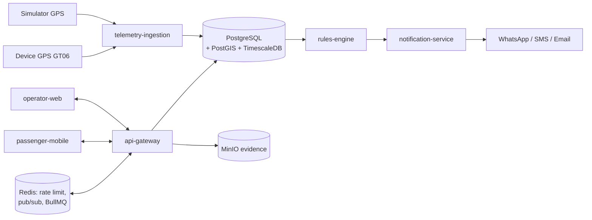

# SI UNCAL — Monitoring Angkot Kota Bogor

Sistem monitoring armada angkot realtime SI UNCAL untuk **Dinas Perhubungan Kota Bogor** — menekan tindak kriminal di dalam angkot (jambret, pelecehan, intimidasi) dan menegakkan kepatuhan operasional armada (ngetem, off-route, putar arah liar).

`apps/operator-web` (Next.js) · `apps/passenger-mobile` (Flutter) · `services/*` (Node.js) · PostgreSQL/TimescaleDB · Redis · MinIO · Docker

---

## Fitur Unggulan

| Area | Kemampuan |
|------|-----------|
| **Monitoring realtime** | Peta live, cluster marker, filter trayek/status, playback riwayat, heatmap operasional |
| **Deteksi anomali** | Rules engine: `NGETEM`, `OFF_ROUTE`, `OVERSPEED`, `LOST_SIGNAL` + map-matching OSRM/PostGIS |
| **Incident center** | Ack / assign / resolve / false-alarm, SLA, audit log, tinjauan otomatis berbasis rules |
| **Reporting** | Harian (RIT, KPI), export CSV, fleet compliance, sanksi, network view |
| **Keamanan** | RBAC (OPERATOR / ANALISA / PETUGAS LAPANGAN), CSRF, rate limit, audit log |
| **Masyarakat** | Aplikasi mobile Flutter: tracking publik, lapor insiden + bukti foto (MinIO), SOS / emergency board |

> **Catatan jujur:** telemetry GPS demo berasal dari **simulator** (bukan device fisik), dan tinjauan laporan otomatis bersifat **rules-assisted** (deterministik + skor kepercayaan yang dapat dijelaskan), bukan model bahasa.

---

## Arsitektur



Semua service berjalan di belakang **api-gateway**; datastore tunggal Postgres + PostGIS + TimescaleDB (ADR-0002). Detail arsitektur: [`docs/01-system-architecture.md`](docs/01-system-architecture.md) dan [`docs/README.md`](docs/README.md).

---

## Struktur Proyek

```
apps/operator-web/       Dashboard operator (Next.js 16)
apps/passenger-mobile/   Aplikasi masyarakat (Flutter)
services/                Backend: api-gateway, telemetry-ingestion,
                         rules-engine, notification-service
db/                      Schema, migration (001–015), seed
infra/                   docker-compose, k8s, monitoring
docs/                    PRD, API spec, runbook, roadmap, QA
.scratch/                Issue tracker lokal: daftar issue yang harus dikerjakan
```

---

## Quick Start (Docker)

```sh
# 1. Siapkan env (sekali)
cp infra/docker-compose/.env.example infra/docker-compose/.env

# 2. Nyalakan full stack
docker compose --env-file infra/docker-compose/.env -f infra/docker-compose/docker-compose.yml up -d --build

# 3. Verifikasi API
curl -i http://localhost:4000/health      # -> 200 {"ok":true,...}
curl -i http://localhost:4000/ready       # -> 200 bila Postgres, Redis, MinIO siap

# 4. Jalankan simulator GPS (45 armada demo, 5 detik/ping)
docker compose --env-file infra/docker-compose/.env -f infra/docker-compose/docker-compose.yml --profile simulator up -d --build vehicle-simulator
```

Login operator di `http://localhost:3000/auth/login`.

### Service & Port

| Service | URL |
|---------|-----|
| Operator Web | `http://localhost:3000` |
| API Gateway | `http://localhost:4000` |
| MinIO Console | `http://localhost:9001` |
| Postgres | `127.0.0.1:5433` (db `Sentra`, user `monitoring`) |

### Akun Demo

| Role | Email | Password |
|------|-------|----------|
| Operator | `operator@pemda.go.id` | `password123` |
| Analisa | `analisa@pemda.go.id` | `password123` |
| Petugas Lapangan | `lapangan@pemda.go.id` | `password123` |
| Masyarakat (mobile) | `warga@sentra.id` | `password123` |

---

## Reporting & Test

```sh
# Laporan harian (RIT, KPI) + export CSV
docker compose --env-file infra/docker-compose/.env -f infra/docker-compose/docker-compose.yml run --rm api-gateway npm run report:today

# Unit + contract test
docker compose --env-file infra/docker-compose/.env -f infra/docker-compose/docker-compose.yml run --rm api-gateway npm test

# Lint dashboard operator
cd apps/operator-web && npm run lint
```

---

## Dokumentasi

| Topik | Lokasi |
|-------|--------|
| Dokumentasi index | [`docs/README.md`](docs/README.md) |
| PRD & API spec | [`docs/API.md`](docs/API.md), [`docs/ROADMAP.md`](docs/ROADMAP.md) |
| Arsitektur | [`docs/01-system-architecture.md`](docs/01-system-architecture.md), [`docs/adr/`](docs/adr/) |
| Runbook | [`docs/runbooks/`](docs/runbooks/) — GPS GT06, security hardening, scale-out, Flutter build, emergency drill |
| Kesiapan demo | [`docs/qa/final-demo-readiness.md`](docs/qa/final-demo-readiness.md) |
| Analisis kode fitur | [`docs/architecture/feature-code-analysis.md`](docs/architecture/feature-code-analysis.md) |

## Issue Tracker (`.scratch/`)

Daftar pekerjaan yang belum dikerjakan (issue + PRD) tersimpan sebagai file Markdown lokal di `.scratch/`, satu folder per fitur:

```
.scratch/<feature-slug>/
├── PRD.md                    Product requirement dokumen fitur (jika ada)
└── issues/
    └── <NN>-<slug>.md        Issue berurut dari 01, berisi Status:, Scope:, dan detail tugas
```

- `Status:` — kondisi triase issue (contoh: `ready-for-agent`, `in-progress`, `done`).
- `Scope:` — batas pekerjaan: `fullstack`, `backend`, `frontend`, atau `parallel`.
- Ringkasan urutan eksekusi: [`.scratch/EXECUTION-ORDER.md`](.scratch/EXECUTION-ORDER.md) · status fitur: [`.scratch/FEATURE-STATUS.md`](.scratch/FEATURE-STATUS.md).

Konvensi lengkap: [`docs/agents/issue-tracker.md`](docs/agents/issue-tracker.md).

### Troubleshooting singkat

- **`api-gateway` exit / schema missing** — volume Postgres lama drift. Terapkan migration/seed yang kurang, atau reset bersih `docker compose ... down -v` lalu `up -d --build`. Detail: [`docs/runbooks/security-hardening.md`](docs/runbooks/security-hardening.md).
- **Emergency workflow gagal / petugas lapangan tak bisa login** — jalankan `./scripts/apply-phase19-emergency-runtime.sh` (preflight non-destruktif; `SEED_DEMO_FIELD_OFFICER=true` untuk lokal/demo).
- **Volume lama masih 3 pemilik / 9 armada** — terapkan `db/seeds/005_demo_fleet_45.sql` tanpa reset data.
- **Telemetry tidak masuk / `503 AUTH_NOT_CONFIGURED`** — set `TELEMETRY_INGEST_TOKEN` di `.env` (dipakai api-gateway dan simulator).

---

## Status Proyek

Fitur inti **ready** untuk demo (realtime tracking, rules engine, incident center, reporting, RBAC, public report + SOS). Notifikasi eksternal (WhatsApp/SMS/email) masih **partial** — `notification-service` saat ini log-only. Roadmap selengkapnya di [`docs/ROADMAP.md`](docs/ROADMAP.md).
