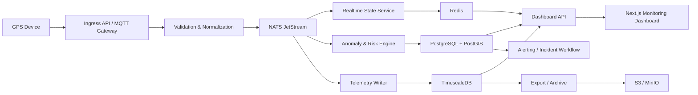

# Arsitektur Sistem Monitoring Angkot

## Tujuan

Dokumen ini menjelaskan arsitektur target untuk sistem monitoring angkot yang mendukung pelacakan armada secara real-time, kepatuhan trayek, deteksi anomali operasional, dan dasar penegakan sanksi berbasis data.

Target awal sistem adalah skala pilot hingga skala kota, dengan interval pengiriman GPS `5-15 detik` per kendaraan.

## Audiens

- Tim backend
- Tim frontend
- Tim data/platform
- Product owner atau pemangku kepentingan operasional Dishub

## Sasaran Sistem

Sistem harus mampu:

- Menampilkan posisi terakhir kendaraan secara real-time.
- Menyimpan histori telemetry untuk playback dan analisis.
- Mendeteksi pelanggaran dasar seperti keluar trayek, ngetem di luar zona resmi, dan perangkat offline mendadak.
- Menghasilkan alert, incident, dan risk score yang dapat ditindaklanjuti operator.
- Menyajikan profil detail kendaraan saat marker peta dipilih, termasuk identitas kendaraan, identitas pemilik, dan riwayat pelanggaran.
- Menyediakan analitik kepatuhan tingkat armada untuk mendeteksi pola pelanggaran terorganisir, kolusi operasional, anomali kolektif, dan fraud device.
- Menyediakan fondasi yang masih sederhana untuk MVP, tetapi tidak menghambat scale-out saat jumlah armada meningkat.

## Entitas Sistem

- `GPS Device`: perangkat pengirim telemetry kendaraan.
- `Kendaraan/Angkot`: objek yang dipantau sistem.
- `Pemilik Armada`: entitas registrasi armada yang terkait ke satu atau lebih kendaraan.
- `Dashboard Monitoring Internal`: antarmuka operasional untuk pemantauan dan tindak lanjut internal.

## Rekomendasi Stack

- Frontend: `Next.js`, `TypeScript`, `Tailwind CSS`, `MapLibre`
- Backend: `Go`
- Database utama: `PostgreSQL`
- Ekstensi geospasial: `PostGIS`
- Time-series storage: `TimescaleDB`
- Cache dan state real-time: `Redis`
- Event broker: `NATS JetStream`
- Arsip dan export: `S3` atau `MinIO`
- Observability: `Prometheus`, `Grafana`, `Loki`
- Deployment awal: `Docker`
- Deployment saat scale: `Kubernetes`

## Alasan Pemilihan Stack

### Frontend

`Next.js + TypeScript` cocok untuk dashboard internal karena:

- cepat dikembangkan,
- mudah membangun halaman admin dan dashboard,
- kuat untuk integrasi peta dan real-time UI,
- tetap fleksibel jika nantinya butuh server-side rendering untuk halaman tertentu.

`MapLibre` dipilih karena:

- tidak terkunci ke vendor tertentu,
- cukup matang untuk visualisasi peta operasional,
- cocok jika tile source ingin dikelola sendiri.

### Backend

`Go` direkomendasikan karena:

- efisien untuk beban I/O tinggi dari ingestion GPS,
- cocok untuk service dengan latensi rendah,
- concurrency model sederhana untuk pipeline telemetry dan rule processing.

### Data Layer

`PostgreSQL + PostGIS + TimescaleDB` dipilih agar:

- master data, workflow operasional, dan histori time-series tetap berada pada ekosistem yang sama,
- query geospatial seperti corridor tolerance dan geofence bisa dilakukan native,
- telemetry historis bisa dioptimalkan dengan hypertable, compression, dan retention policy.

### Messaging dan Cache

`NATS JetStream` memberikan event streaming yang ringan untuk pipeline real-time.

`Redis` dipakai untuk:

- last known position,
- presence/status kendaraan,
- cache query dashboard,
- deduplikasi event jangka pendek.

## Arsitektur End-to-End

## Komponen Logis

### 1. Ingestion Service

Tanggung jawab:

- menerima data dari GPS device melalui HTTP, TCP, atau MQTT gateway,
- melakukan autentikasi perangkat,
- validasi format payload,
- normalisasi waktu, koordinat, kecepatan, heading, dan metadata device,
- menerbitkan event telemetry ke broker.

Komponen ini harus sangat tipis dan stabil. Business logic tidak ditaruh di sini.

### 2. Realtime State Service

Tanggung jawab:

- menghitung last known position,
- menyimpan status online/offline,
- menyimpan snapshot kendaraan yang akan dibaca dashboard,
- memberi feed cepat untuk peta real-time.

Penyimpanan utama komponen ini adalah `Redis`.

### 3. Telemetry Writer

Tanggung jawab:

- mengonsumsi event telemetry dari broker,
- menulis raw telemetry ke `TimescaleDB`,
- menerapkan batch write bila diperlukan,
- mengelola retention dan compression.

### 4. Anomaly and Risk Engine

Tanggung jawab:

- mengevaluasi event streaming terhadap rule operasional,
- menghitung risk score kendaraan,
- membuat alert,
- menaikkan incident bila severity atau frekuensi melewati ambang batas.

Engine ini dapat dimulai sebagai service Go terpisah secara logis, belum perlu microservice ecosystem penuh.

### 5. Fleet Intelligence and Fraud Analytics

Tanggung jawab:

- mendeteksi pola pelanggaran terorganisir pada kendaraan-kendaraan milik pemilik yang sama,
- mendeteksi kolusi operasional, misalnya beberapa kendaraan kosong dari koridor tertentu lalu berkumpul di titik yang sama,
- mendeteksi anomali kolektif seperti banyak kendaraan pada trayek yang sama offline bersamaan,
- menganalisis perpindahan GPS device antar kendaraan yang terlalu sering atau identitas device yang tidak konsisten,
- menghitung `risk propagation` dari kendaraan ke tingkat pemilik armada untuk prioritas pengawasan.

Komponen ini sebaiknya membaca data turunan dan agregasi periodik, bukan hanya event tunggal, karena fokusnya adalah pola lintas kendaraan dan lintas waktu.

### 6. Admin and Dashboard API

Tanggung jawab:

- menyajikan data untuk dashboard,
- mengelola master data,
- menyajikan profil detail kendaraan dan pemilik armada,
- menyediakan query playback dan reporting dasar,
- menyediakan query intelijen armada, network view, dan investigasi pola kolektif,
- mengelola incident, sanction, dan audit trail.

### 7. Monitoring Dashboard

Fungsi utama:

- live map,
- filter armada dan trayek,
- daftar alert aktif,
- playback perjalanan,
- ringkasan kepatuhan dan risk score,
- panel detail kendaraan saat marker angkot diklik.

Data minimum pada panel detail kendaraan:

- foto kendaraan,
- nomor polisi,
- kode armada,
- trayek aktif,
- nama pemilik,
- alamat pemilik,
- status online atau offline,
- risk score terkini,
- riwayat pelanggaran seperti `ngetem`, `keluar trayek`, `offline`, dan `tamper`.

Kapabilitas analitik lanjutan yang disarankan:

- dashboard kepatuhan per pemilik armada,
- deteksi pola pelanggaran terorganisir,
- deteksi kolusi operasional antar kendaraan,
- panel anomali kolektif per trayek,
- `network view` relasi pemilik, kendaraan, device, incident, dan sanction,
- fraud analytics untuk GPS device,
- daftar outlier kendaraan terhadap pola trayek normal.

## Alur Data

Urutan alur utama:

1. `GPS device` mengirim payload lokasi secara periodik.
2. `Ingestion service` memvalidasi dan menormalisasi payload.
3. Event valid dipublikasikan ke `NATS JetStream`.
4. `Realtime state service` memperbarui posisi terakhir dan status kendaraan di `Redis`.
5. `Telemetry writer` menyimpan event ke `TimescaleDB`.
6. `Anomaly and risk engine` mengevaluasi event terhadap rule kepatuhan.
7. Hasil rule disimpan sebagai `alerts`, `anomalies`, `incidents`, atau pembaruan `risk_scores`.
8. `Dashboard API` menggabungkan data dari Redis, PostgreSQL, dan TimescaleDB untuk frontend, termasuk profil kendaraan dan pemilik.
9. `Fleet intelligence layer` membentuk agregasi dan sinyal lintas kendaraan, lintas trayek, dan lintas pemilik.
10. Operator memantau dashboard dan menindaklanjuti alert atau incident.

## Kapabilitas Analitik Lanjutan

Fitur analitik yang direkomendasikan untuk fase lanjutan:

- Deteksi pola pelanggaran terorganisir pada satu pemilik armada.
- Deteksi kolusi operasional, misalnya beberapa kendaraan sengaja mengosongkan koridor tertentu lalu menumpuk di titik tertentu.
- Analisis anomali kolektif, misalnya banyak armada pada trayek yang sama offline bersamaan.
- `Network view` pemilik armada, kendaraan, device, incident, dan sanction history.
- Fraud analytics untuk perangkat GPS yang sering berpindah atau memiliki identitas device yang tidak konsisten.
- Outlier detection untuk armada yang terlalu sering lolos dari pola normal trayek.
- Risk propagation, yaitu ketika satu pemilik memiliki beberapa kendaraan high-risk sehingga prioritas pengawasan meningkat.

## Batasan Sistem

Batasan fase awal:

- Belum mengoptimalkan machine learning; deteksi awal berbasis rules.
- Belum memerlukan pemisahan microservices penuh.
- Belum mendukung high availability multi-region.
- Belum mengintegrasikan penindakan lapangan otomatis.
- Belum menganggap data GPS selalu sempurna; sistem harus toleran terhadap noise dan gap.

## Non-Functional Requirements

### Kinerja

- Update posisi ke dashboard: target `1-5 detik` dari event diterima.
- Query last known position: target `p95 < 300 ms`.
- Query playback harian per kendaraan: target `p95 < 3 detik` untuk rentang umum.

### Keandalan

- Event broker harus mendukung replay terbatas.
- Ingestion harus idempotent terhadap duplicate payload sederhana.
- Sistem harus tetap menerima data walau anomaly engine sedang lag, selama broker masih sehat.

### Skalabilitas

- Komponen ingestion, realtime state, telemetry writer, dan dashboard API harus bisa di-scale horizontal.
- Skema data time-series harus siap untuk pertumbuhan cepat volume telemetry.

### Auditabilitas

- Setiap perubahan rule, sanction, dan incident harus tercatat dalam audit log.
- Dasar pembentukan incident perlu dapat ditelusuri ke alert dan telemetry yang relevan.

### Keamanan

- Device authentication wajib.
- Kontrol akses dashboard internal wajib diterapkan sesuai kebutuhan operasional.
- Seluruh endpoint admin harus memiliki audit trail.

## Modular Monolith vs Microservices

### Opsi 1: Modular Monolith

Kelebihan:

- pengembangan lebih cepat,
- deployment lebih sederhana,
- overhead operasional kecil,
- mudah untuk tim kecil.

Kekurangan:

- batas skalabilitas komponen tidak terpisah sempurna,
- risk blast radius lebih besar bila satu aplikasi sangat gemuk.

### Opsi 2: Microservices

Kelebihan:

- scale per domain lebih fleksibel,
- isolasi komponen lebih kuat,
- cocok untuk organisasi dan volume yang sudah besar.

Kekurangan:

- kompleksitas observability, deployment, dan debugging naik signifikan,
- biaya infrastruktur dan koordinasi tim bertambah,
- terlalu mahal untuk fase MVP.

## Rekomendasi Final

Gunakan pendekatan `modular services`:

- service dipisah secara logis sejak awal,
- repository code boleh terpisah per service atau tetap monorepo,
- deployment masih sederhana,
- kontrak antar komponen sudah berbasis event dan API sehingga migrasi ke microservices penuh nanti tidak menyakitkan.

Struktur logis yang direkomendasikan:

- `ingestion-service`
- `realtime-state-service`
- `anomaly-risk-engine`
- `admin-dashboard-api`
- `frontend-dashboard`

## Tahap Evolusi yang Disarankan

### Fase 1: Pilot

- satu cluster kecil,
- PostgreSQL + PostGIS + TimescaleDB terpusat,
- Redis tunggal,
- NATS JetStream sederhana,
- dashboard internal untuk operator.

### Fase 2: Multi-Koridor

- scale horizontal ingestion dan dashboard API,
- tambah observability penuh,
- optimalkan compression dan retention telemetry,
- mulai pisahkan workload reporting berat.

### Fase 3: Skala Kota

- pertimbangkan pemisahan service lebih tegas,
- tambahkan read replica atau strategi analytical store,
- perketat incident management dan sanction workflow,
- tambahkan kapasitas broker dan HA Redis.

## Ringkasan

Arsitektur yang direkomendasikan berfokus pada keseimbangan antara kecepatan implementasi MVP dan kesiapan scale. Kunci desainnya adalah pemisahan tanggung jawab ingestion, state real-time, telemetry historis, dan rule engine, tanpa langsung membebani tim dengan kompleksitas microservices penuh.
