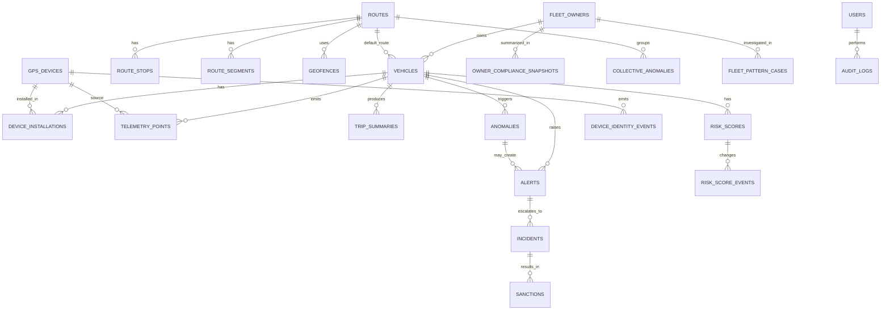

# ERD Bisnis Sistem Monitoring Angkot

## Tujuan

Dokumen ini mendefinisikan model data bisnis tingkat tinggi untuk sistem monitoring angkot. Fokus dokumen ini adalah hubungan antar entitas inti, bukan detail semua kolom teknis.

## Prinsip Desain Data

- Pisahkan `master data`, `operational data`, dan `analytical/time-series data`.
- Pertahankan jejak audit untuk tindakan operasional dan kebijakan sanksi.
- Simpan data geospasial secara native agar rule trayek dan geofence dapat dihitung akurat.
- Perlakukan telemetry mentah sebagai data volume tinggi yang berbeda karakteristiknya dari data transaksi operasional.

## Entitas Utama

### Master Data

- `fleet_owners`
- `vehicles`
- `routes`
- `route_stops`
- `route_segments`
- `geofences`
- `gps_devices`
- `users`

### Operational Data

- `device_installations`
- `alerts`
- `incidents`
- `sanctions`
- `risk_scores`
- `risk_score_events`
- `anomalies`
- `audit_logs`

### Analytical and Intelligence Data

- `owner_compliance_snapshots`
- `collective_anomalies`
- `device_identity_events`
- `fleet_pattern_cases`

### Time-Series and Analytical Data

- `telemetry_points`
- `trip_summaries`
- `daily_vehicle_metrics`

## Deskripsi Entitas

### `fleet_owners`

Pemilik atau pengelola armada. Satu pemilik dapat memiliki banyak kendaraan.

### `vehicles`

Representasi unit angkot. Menyimpan identitas kendaraan, trayek utama, status aktif, dan keterkaitan ke pemilik armada.

### `routes`

Definisi trayek bisnis, misalnya trayek A ke B, lengkap dengan kode dan status aktif.

### `route_stops`

Titik pemberhentian resmi atau checkpoint penting di sebuah trayek.

### `route_segments`

Segmen geospasial pembentuk corridor trayek. Dipakai untuk menghitung kepatuhan jalur.

### `geofences`

Area tertentu seperti terminal, pool, zona ngetem resmi, atau area larangan.

### `gps_devices`

Perangkat GPS fisik yang terpasang ke kendaraan. Satu kendaraan dapat memiliki histori beberapa perangkat dari waktu ke waktu.

### `device_installations`

Riwayat pemasangan perangkat pada kendaraan. Penting untuk audit dan analisis dugaan tamper.

### `telemetry_points`

Data lokasi mentah volume tinggi yang dikirim berkala oleh perangkat GPS.

### `trip_summaries`

Ringkasan perjalanan yang diturunkan dari telemetry, misalnya jam mulai, jam selesai, jarak, durasi, dan ringkasan kepatuhan.

### `anomalies`

Catatan hasil deteksi rule per kejadian atau per window evaluasi.

### `risk_scores`

Skor risiko terkini per kendaraan.

### `risk_score_events`

Jejak event perubahan skor untuk audit dan analisis.

### `alerts`

Notifikasi operasional yang perlu diperhatikan operator.

### `incidents`

Kasus yang telah dinaikkan dari alert atau anomaly karena severity atau frekuensi cukup tinggi.

### `sanctions`

Tindakan administratif atau operasional yang dikenakan berdasarkan incident.

### `users`

Pengguna internal sistem monitoring seperti admin dan operator.

### `audit_logs`

Jejak perubahan penting pada master data, rules, incident, dan sanction.

### `owner_compliance_snapshots`

Ringkasan berkala kepatuhan per pemilik armada, misalnya jumlah kendaraan aktif, jumlah kendaraan high-risk, total anomaly, dan incident terbuka.

### `collective_anomalies`

Catatan anomali lintas kendaraan, misalnya offline massal pada trayek yang sama atau penumpukan kendaraan yang tidak normal.

### `device_identity_events`

Jejak event terkait integritas device, misalnya device berpindah kendaraan terlalu sering, IMEI tidak konsisten, atau fingerprint perangkat berubah.

### `fleet_pattern_cases`

Kasus investigasi pola armada seperti dugaan pelanggaran terorganisir, kolusi operasional, atau risk propagation pada satu pemilik.

## Relasi Antar Entitas

## Penjelasan Pola Relasi Penting

### Kendaraan, Pemilik, dan Device

Relasi utama pada MVP adalah antara kendaraan, pemilik, dan device:

- pemilik dihubungkan ke kendaraan melalui `fleet_owners`,
- device dihubungkan ke kendaraan melalui `device_installations`.

Pendekatan ini menjaga keterlacakan registrasi armada dan histori perangkat.

### Route dan Geospatial Model

`routes` adalah entitas bisnis. Implementasi geospasialnya dipecah ke:

- `route_segments` untuk corridor atau garis trayek,
- `route_stops` untuk titik penting,
- `geofences` untuk area resmi seperti terminal dan zona tertentu.

### Alert, Incident, dan Sanction

Urutan proses yang direkomendasikan:

1. `anomaly` mendeteksi kejadian.
2. `alert` dibuat untuk notifikasi operasional.
3. `incident` dibuka jika severity atau frekuensi memenuhi syarat eskalasi.
4. `sanction` diterbitkan berdasarkan keputusan atau aturan kebijakan.

Tidak semua anomaly harus menjadi incident, dan tidak semua incident harus berujung sanction.

## Operational vs Analytical Tables

### Operational Tables

Tabel berikut mendukung alur kerja aplikasi sehari-hari:

- `vehicles`
- `fleet_owners`
- `routes`
- `gps_devices`
- `device_installations`
- `alerts`
- `incidents`
- `sanctions`
- `risk_scores`
- `users`
- `audit_logs`

Ciri utamanya:

- update dan lookup sering,
- volume moderat,
- membutuhkan konsistensi transaksi kuat.

### Analytical and Time-Series Tables

Tabel berikut berkarakter volume tinggi atau turunan analitik:

- `telemetry_points`
- `trip_summaries`
- `daily_vehicle_metrics`
- `risk_score_events`
- `owner_compliance_snapshots`
- `collective_anomalies`
- `device_identity_events`
- `fleet_pattern_cases`

Ciri utamanya:

- write terus-menerus,
- query berbasis rentang waktu,
- perlu strategi partitioning, compression, dan retention.

## Catatan Partitioning dan Retention

### `telemetry_points`

- dijadikan `hypertable` berdasarkan waktu,
- partition tambahan dapat menggunakan `vehicle_id` bila volume sangat besar,
- retention mentah disarankan `3-12 bulan` sesuai kebutuhan audit.

### `trip_summaries`

- dapat dipartisi per bulan bila volume tinggi,
- disimpan lebih lama daripada telemetry mentah karena lebih ringkas dan berguna untuk pelaporan.

### `audit_logs`

- partisi per bulan atau per kuartal bila diperlukan,
- retensi minimal mengikuti kebijakan audit instansi.

## Asumsi Kunci

- Satu kendaraan memiliki satu trayek utama aktif dalam satu waktu, walau histori trayek perlu tetap tersimpan bila ada perubahan.
- Satu pemilik armada dapat memiliki banyak kendaraan.
- Risk score melekat ke `vehicle`.
- Alert dan incident harus dapat dilacak balik ke evidence telemetry.

## Kebutuhan Tampilan Profil Kendaraan

Untuk mendukung popup atau panel detail saat marker angkot dipilih di peta, model data perlu dapat menyajikan:

- identitas kendaraan,
- foto kendaraan,
- nomor polisi,
- trayek aktif,
- nama pemilik,
- alamat pemilik,
- device aktif,
- risk score terkini,
- daftar anomaly, alert, dan incident terbaru.

## Kebutuhan Analitik Lanjutan

Untuk mendukung pengawasan tingkat armada dan investigasi pola:

- sistem perlu ringkasan kepatuhan per pemilik armada,
- sistem perlu menyimpan kasus pola kolektif lintas kendaraan,
- sistem perlu jejak integritas device untuk fraud analytics,
- sistem perlu struktur data yang dapat divisualisasikan sebagai `network view`.

## Ringkasan

ERD ini memisahkan dengan jelas domain armada, domain operasional, dan domain telemetry. Struktur ini cukup stabil untuk MVP, namun tetap memberi ruang untuk analitik yang lebih kaya ketika skala sistem membesar.
