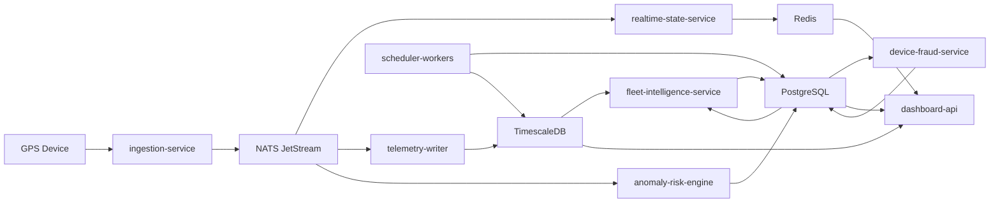

# Breakdown Service Backend

## Tujuan

Dokumen ini mendefinisikan pembagian service backend untuk sistem monitoring angkot, beserta tanggung jawab, alur data, dependensi, dan prioritas implementasinya.

## Prinsip Desain Service

- mulai dari service yang terpisah secara logis,
- service dipisahkan berdasarkan tanggung jawab domain,
- jalur real-time dan jalur analitik dibedakan,
- service lanjutan membaca event dan data turunan, bukan membebani ingestion langsung,
- semua service harus observable dan idempotent sejauh mungkin.

## Service Utama

Service yang direkomendasikan:

1. `ingestion-service`
2. `realtime-state-service`
3. `telemetry-writer`
4. `anomaly-risk-engine`
5. `dashboard-api`
6. `fleet-intelligence-service`
7. `device-fraud-service`
8. `scheduler-workers`

## 1. Ingestion Service

### Tanggung Jawab

- menerima payload GPS dari device,
- autentikasi device,
- validasi format payload,
- normalisasi field,
- membentuk event telemetry standar,
- publish ke `NATS JetStream`.

### Input

- HTTP payload
- TCP payload
- MQTT payload bila dipakai

### Output

- `telemetry.received`

### Dependency

- `PostgreSQL` atau cache kecil untuk lookup device
- `NATS JetStream`

### Catatan

- service ini harus tipis,
- business rule jangan dimasukkan ke sini,
- retry dan dedup ringan boleh dilakukan di sini.

## 2. Realtime State Service

### Tanggung Jawab

- consume event telemetry,
- update last known position,
- update online/offline status,
- simpan snapshot kendaraan ke `Redis`,
- sediakan feed untuk marker peta real-time.

### Input

- `telemetry.received`

### Output

- cache state kendaraan
- optional event `vehicle.state.updated`

### Dependency

- `Redis`
- `NATS JetStream`

## 3. Telemetry Writer

### Tanggung Jawab

- consume event telemetry,
- menulis raw telemetry ke `TimescaleDB`,
- memastikan write efisien,
- menangani batch insert bila dibutuhkan.

### Input

- `telemetry.received`

### Output

- row baru pada `telemetry_points`
- optional event `telemetry.persisted`

### Dependency

- `PostgreSQL + TimescaleDB`
- `NATS JetStream`

## 4. Anomaly Risk Engine

### Tanggung Jawab

- mendeteksi anomaly kendaraan,
- menghitung delta risk score,
- membuat alert,
- membuka incident bila perlu,
- menulis `risk_score_events`.

### Input

- `telemetry.received`
- master data kendaraan
- route corridor
- geofence resmi

### Output

- `anomalies`
- `alerts`
- `incidents`
- `risk_scores`
- `risk_score_events`
- optional event `anomaly.detected`

### Rule Awal

- keluar trayek
- ngetem di luar zona resmi
- offline mendadak
- tamper device
- kecepatan tidak wajar
- putar balik tidak normal

## 5. Dashboard API

### Tanggung Jawab

- menyediakan endpoint frontend,
- menggabungkan data dari Redis dan PostgreSQL,
- melayani detail kendaraan,
- melayani playback,
- melayani daftar alert dan incident,
- menyajikan data owner priority dan case list.

### Input

- query frontend

### Output

- respons JSON untuk dashboard

### Dependency

- `Redis`
- `PostgreSQL`
- `TimescaleDB`

## 6. Fleet Intelligence Service

### Tanggung Jawab

- mendeteksi pola pelanggaran terorganisir,
- mendeteksi kolusi operasional,
- mendeteksi anomali kolektif,
- menghitung risk propagation pada level pemilik,
- membentuk `fleet_pattern_cases`,
- membentuk `owner_compliance_snapshots`.

### Input

- `anomalies`
- `alerts`
- `incidents`
- `risk_scores`
- `telemetry_points`

### Output

- `owner_compliance_snapshots`
- `collective_anomalies`
- `fleet_pattern_cases`
- optional event `fleet.pattern.detected`

### Pola yang Ditangani

- organized violation pada satu pemilik,
- corridor emptying,
- abnormal clustering,
- offline massal per trayek,
- owner risk propagation.

### Catatan

- service ini tidak harus real-time ketat,
- bisa berjalan per menit atau per beberapa menit,
- cocok dibuat sebagai worker berbasis schedule dan event campuran.

## 7. Device Fraud Service

### Tanggung Jawab

- melacak histori device installation,
- mendeteksi IMEI mismatch,
- mendeteksi fingerprint device berubah,
- mendeteksi device terlalu sering pindah kendaraan,
- menghitung fraud score device.

### Input

- `telemetry.received`
- `device_installations`
- metadata device

### Output

- `device_identity_events`
- optional event `device.fraud.detected`

### Catatan

- fraud analytics sebaiknya terpisah dari anomaly engine supaya concern tidak bercampur,
- hasilnya bisa dipakai oleh dashboard dan incident workflow.

## 8. Scheduler Workers

### Tanggung Jawab

- menjalankan job agregasi periodik,
- membentuk `daily_vehicle_metrics`,
- membentuk snapshot owner harian,
- housekeeping retention,
- job sinkronisasi status offline periodik bila diperlukan.

### Job yang Disarankan

- `build_daily_vehicle_metrics`
- `build_owner_compliance_snapshots`
- `detect_collective_anomalies`
- `detect_device_reassignment_spike`
- `apply_timescale_housekeeping`

## Event Contract Awal

### `telemetry.received`

Payload minimum:

```json
{
  "event_id": "uuid",
  "occurred_at": "2026-04-18T21:00:00Z",
  "vehicle_id": "uuid",
  "gps_device_id": "uuid",
  "latitude": -6.2,
  "longitude": 106.8,
  "speed_kph": 21.4,
  "heading_deg": 134.2,
  "ignition_on": true,
  "battery_voltage": 12.4,
  "power_connected": true,
  "raw_payload": {}
}
```

### `anomaly.detected`

Payload minimum:

```json
{
  "anomaly_id": "uuid",
  "vehicle_id": "uuid",
  "anomaly_type": "out_of_route",
  "severity": "high",
  "detected_at": "2026-04-18T21:00:10Z",
  "score_impact": 12
}
```

### `fleet.pattern.detected`

Payload minimum:

```json
{
  "fleet_pattern_case_id": "uuid",
  "fleet_owner_id": "uuid",
  "case_type": "risk_propagation",
  "severity": "high",
  "opened_at": "2026-04-18T21:05:00Z"
}
```

## Dependency Map



## Modul Internal per Service

### `ingestion-service`

- transport adapter
- payload parser
- device auth
- normalizer
- publisher

### `anomaly-risk-engine`

- route compliance checker
- idling detector
- offline detector
- tamper detector
- scoring calculator
- alert escalation

### `dashboard-api`

- realtime module
- vehicles module
- owners module
- intelligence module
- devices module
- incidents module
- network module

### `fleet-intelligence-service`

- owner compliance aggregator
- organized violation detector
- collective anomaly detector
- propagation analyzer
- case builder

## Prioritas Implementasi

### Fase 1

- `ingestion-service`
- `realtime-state-service`
- `telemetry-writer`
- `dashboard-api`

### Fase 2

- `anomaly-risk-engine`
- `scheduler-workers`

### Fase 3

- `fleet-intelligence-service`
- `device-fraud-service`

## Risiko Teknis

- event duplikasi menyebabkan anomaly ganda,
- query gabungan dashboard terlalu berat,
- status offline berbeda antara cache dan database,
- deteksi kolektif terlalu mahal bila langsung membaca telemetry mentah terus-menerus.

## Mitigasi

- gunakan event idempotency key,
- pisahkan read model dashboard dari write path,
- gunakan snapshot dan agregasi periodik,
- batasi rule berat ke service intelligence terpisah,
- simpan evidence minimal tetapi cukup untuk audit.

## Ringkasan

Breakdown service ini menjaga jalur real-time tetap cepat sambil memberi ruang untuk analitik kepatuhan dan intelligence operasional yang lebih berat. Pendekatan ini cocok untuk mulai dari MVP lalu berkembang tanpa refactor besar di awal.
