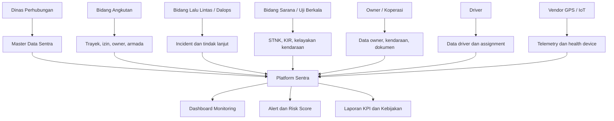

# Sentra - Kebutuhan Data dan Stakeholder Pemerintah Bogor

## 1. Ringkasan

Sentra adalah platform monitoring, pengawasan, dan pengelolaan operasional angkutan kota/angkot berbasis data. Platform ini ditujukan terutama untuk Pemerintah Daerah Bogor melalui Dinas Perhubungan sebagai pengguna utama, dengan dukungan data dari pemilik angkot, koperasi/organisasi angkutan, driver, petugas lapangan, dan perangkat GPS kendaraan.

Tujuan utama Sentra:

- memberi visibilitas realtime terhadap posisi dan status armada angkot;
- membantu pengawasan kepatuhan trayek, jam operasi, dan perilaku operasional;
- mendeteksi anomali seperti ngetem, keluar trayek, overspeed, dan lost signal;
- menyediakan incident center untuk tindak lanjut kejadian;
- menyediakan laporan KPI sebagai bahan pembinaan, evaluasi, dan kebijakan transportasi.

## 2. Sasaran Pengguna Utama

Pengguna utama Sentra adalah Dinas Perhubungan Kota Bogor atau Kabupaten Bogor, tergantung target implementasi wilayah. Dalam struktur Dishub, unit yang paling relevan adalah bidang yang mengurus angkutan umum, lalu lintas, pengendalian operasional, sarana transportasi jalan, dan pengujian kendaraan bermotor.

Rumusan singkat untuk paparan:

> Sentra ditujukan untuk Dinas Perhubungan Bogor sebagai platform pengawasan dan pengelolaan angkot secara digital. Pemilik angkot, koperasi/organisasi angkutan, driver, dan perangkat GPS menjadi pihak pendukung yang menyediakan data dan menerima tindak lanjut operasional.

## 3. Stakeholder dan Perannya

| Stakeholder | Status di Platform | Kontribusi Utama | Output yang Diterima |
| --- | --- | --- | --- |
| Dinas Perhubungan Bogor | Pengguna utama | Mengelola kebijakan operasional, pengawasan, master data, incident, dan laporan | Dashboard realtime, alert, incident, KPI, laporan kepatuhan |
| Bidang Angkutan | Pengguna utama teknis | Validasi trayek, armada, izin operasional, pemilik, dan pengelola angkutan | Data armada aktif, kepatuhan trayek, status izin |
| Bidang Lalu Lintas / Pengendalian Operasional | Pengguna utama operasional | Memantau kondisi lapangan, anomali, pelanggaran, dan tindak lanjut incident | Peta realtime, daftar alert, incident center |
| Bidang Sarana Transportasi Jalan / Uji Berkala | Pengguna pendukung internal | Validasi kelayakan kendaraan, masa berlaku KIR, dan status sarana | Daftar kendaraan layak/tidak layak, dokumen KIR, catatan inspeksi |
| UPT / Petugas Lapangan Dishub | Pengguna pendukung operasional | Verifikasi lapangan, penindakan, input catatan tindakan | Daftar tugas, lokasi kejadian, riwayat tindakan |
| Pimpinan Daerah / Kepala Dinas / Bappeda | Pengguna strategis | Mengambil keputusan berbasis laporan dan KPI | Ringkasan performa trayek, risiko, tren masalah |
| Pemilik Angkot / Owner | Kontributor data eksternal | Menyediakan data identitas, kendaraan, dokumen, dan kontak | Notifikasi status kendaraan, dokumen, pembinaan |
| Koperasi / Organisasi Angkutan | Kontributor data eksternal | Mengkoordinasikan pemilik/armada, validasi anggota, dan distribusi informasi | Rekap armada anggota, kepatuhan, status dokumen |
| Driver | Kontributor data operasional | Menyediakan identitas, kontak, SIM, dan menjalankan kendaraan sesuai assignment | Informasi assignment, pembinaan, notifikasi kepatuhan |
| Vendor GPS / Penyedia IoT | Kontributor teknis | Menyediakan device, IMEI/serial, integrasi telemetry, dan health perangkat | Status integrasi, health device, laporan kendala |
| Masyarakat / Penumpang | Opsional fase lanjutan | Mengirim laporan atau SOS jika fitur mobile diaktifkan | Status laporan dan kanal keselamatan |

## 4. Batasan Peran: Dishub vs Pemilik Angkot

Sentra bukan dirancang sebagai portal utama untuk pemilik angkot pada MVP. Pemilik angkot, koperasi, dan driver berperan sebagai penyedia data dan pihak yang ditindaklanjuti. Pengambilan keputusan operasional tetap berada pada pemerintah/Dishub.

Pembagian sederhananya:

- Dishub adalah pengelola sistem, pemantau, analis, dan penindak lanjut.
- Pemilik angkot adalah pemilik aset dan penyedia dokumen kendaraan.
- Driver adalah pelaksana operasional harian.
- Koperasi/organisasi angkutan adalah koordinator administratif dan komunikasi.
- Vendor GPS adalah penyedia data posisi kendaraan.
- Pimpinan daerah adalah penerima laporan strategis.

## 5. Data yang Dibutuhkan Pemerintah Bogor

### 5.1 Data Owner / Pemilik Angkot

Data owner dipakai untuk mengetahui siapa pihak yang bertanggung jawab atas kendaraan, dokumen, pembinaan, dan tindak lanjut bila ada masalah.

| Data | Prioritas | Keterangan |
| --- | --- | --- |
| Nama lengkap owner | Wajib | Identitas utama pemilik/pengelola |
| Jenis owner | Wajib | Personal, koperasi, perusahaan, atau badan hukum |
| NIK owner | Wajib terbatas | Untuk validasi identitas; hanya role berwenang yang boleh melihat |
| Nomor KK | Opsional ketat | Hanya dikumpulkan jika ada dasar kebutuhan administratif resmi |
| Nomor HP utama | Wajib | Kontak pembinaan dan notifikasi |
| Email | Opsional | Untuk notifikasi formal dan akun digital |
| Alamat domisili | Wajib terbatas | Untuk administrasi dan verifikasi |
| Nama base/pool | Wajib jika ada | Dipakai untuk pengecualian operasional, misalnya pulang ke pool |
| Koordinat base/pool | Wajib jika ada | Dipakai oleh rule off-route/deadhead |
| Status verifikasi | Wajib | Pending, verified, rejected, inactive |
| Dokumen KTP | Opsional ketat | Disimpan sebagai dokumen terbatas jika proses verifikasi digital aktif |
| Dokumen badan/koperasi | Kondisional | Wajib jika owner berupa koperasi/perusahaan |

### 5.2 Data Driver

Data driver dipakai untuk assignment, validasi legal berkendara, kontak kejadian, dan pembinaan.

| Data | Prioritas | Keterangan |
| --- | --- | --- |
| Nama lengkap driver | Wajib | Identitas utama driver |
| NIK driver | Wajib terbatas | Untuk validasi identitas |
| Nomor KK | Opsional ketat | Tidak disarankan sebagai data wajib untuk MVP |
| Nomor HP aktif | Wajib | Kontak operasional |
| Alamat domisili | Wajib terbatas | Administrasi dan verifikasi |
| Foto driver | Opsional | Membantu verifikasi lapangan |
| Nomor SIM | Wajib | Legalitas mengemudi |
| Jenis SIM | Wajib | Sesuai kebutuhan angkutan umum |
| Masa berlaku SIM | Wajib | Untuk alert dokumen kedaluwarsa |
| Status driver | Wajib | Active, inactive, suspended |
| Kontak darurat | Opsional | Berguna untuk kejadian keselamatan |
| Riwayat assignment | Wajib operasional | Relasi driver dengan kendaraan dan shift |

### 5.3 Data Kendaraan / Armada

Data kendaraan adalah data inti platform karena monitoring dan risk score melekat pada kendaraan.

| Data | Prioritas | Keterangan |
| --- | --- | --- |
| Nomor polisi | Wajib | Identitas utama kendaraan dan harus unik |
| Owner kendaraan | Wajib | Relasi ke pemilik/pengelola |
| Trayek utama | Wajib | Relasi ke route resmi |
| Kode armada internal | Opsional | Memudahkan identifikasi lapangan |
| Status kendaraan | Wajib | Active, out of service, maintenance, inactive |
| Merek, model, tahun | Wajib administratif | Data profil kendaraan |
| Warna kendaraan | Wajib administratif | Verifikasi lapangan |
| Kapasitas penumpang | Wajib administratif | Data layanan |
| Nomor rangka | Opsional ketat | Sensitif administratif; gunakan jika dibutuhkan verifikasi |
| Nomor mesin | Opsional ketat | Sensitif administratif; gunakan jika dibutuhkan verifikasi |
| Foto kendaraan | Opsional | Verifikasi visual |
| STNK dan masa berlaku | Wajib dokumen | Kepatuhan dokumen kendaraan |
| KIR dan masa berlaku | Wajib dokumen | Kelayakan kendaraan |
| Izin operasional/trayek | Wajib dokumen | Legalitas operasi |

### 5.4 Data Trayek, Stop, Terminal, dan Geofence

Data trayek dipakai untuk menentukan apakah kendaraan patuh terhadap rute resmi.

| Data | Prioritas | Keterangan |
| --- | --- | --- |
| Kode trayek | Wajib | Contoh: 01, 02, 03 |
| Nama trayek | Wajib | Nama jalur atau koridor |
| Titik awal dan akhir | Wajib | Terminal/pangkal tujuan |
| Polyline/geometri outbound | Wajib | Jalur berangkat |
| Polyline/geometri inbound | Wajib | Jalur pulang |
| Buffer radius trayek | Wajib | Toleransi off-route, misalnya 15-30 meter |
| Stop resmi/checkpoint | Wajib | Titik berhenti resmi |
| Terminal/base/pool | Wajib jika ada | Dipakai untuk pengecualian ngetem/off-route |
| Zona larangan/ngetem rawan | Opsional | Untuk rule dan pengawasan lapangan |
| Jam operasional | Wajib | Dipakai untuk lost signal dan KPI |
| Tarif resmi | Opsional | Relevan jika reporting layanan diperluas |

### 5.5 Data Device GPS / IoT

Data device menghubungkan kendaraan dengan sumber telemetry.

| Data | Prioritas | Keterangan |
| --- | --- | --- |
| Device ID | Wajib | ID internal sistem |
| IMEI atau serial number | Wajib | Identitas unik perangkat |
| Jenis device | Wajib | GPS IoT, driver app, atau sumber lain |
| Provider/vendor | Wajib | Penyedia device atau integrator |
| Nomor SIM card device | Opsional ketat | Untuk troubleshooting koneksi |
| Status device | Wajib | Active, assigned, available, inactive, broken |
| Kendaraan terpasang | Wajib operasional | Melalui assignment aktif |
| Tanggal pemasangan | Wajib operasional | Audit pemasangan |
| Tanggal pelepasan | Kondisional | Jika device dilepas |
| Health device | Wajib operasional | Last seen, battery, signal, power jika tersedia |

### 5.6 Data Assignment Operasional

Assignment menjelaskan siapa mengemudikan kendaraan apa, dengan device apa, pada jadwal apa.

| Data | Prioritas | Keterangan |
| --- | --- | --- |
| Kendaraan | Wajib | Unit yang beroperasi |
| Driver | Wajib jika driver tracking aktif | Driver yang ditugaskan |
| Device | Wajib | Sumber telemetry kendaraan |
| Shift name | Opsional | Pagi, siang, malam, atau custom |
| Jam mulai dan selesai | Opsional tapi disarankan | Untuk audit dan KPI |
| Hari operasi | Opsional tapi disarankan | Untuk jadwal berulang |
| Status assignment | Wajib | Aktif atau tidak aktif |

### 5.7 Data Telemetry Kendaraan

Telemetry adalah data operasional realtime yang dikirim perangkat GPS.

| Data | Prioritas | Keterangan |
| --- | --- | --- |
| Vehicle ID / plate_no / IMEI | Wajib | Identitas kendaraan atau device |
| Timestamp | Wajib | Waktu posisi |
| Latitude dan longitude | Wajib | Lokasi kendaraan |
| Kecepatan | Wajib | Untuk overspeed dan status bergerak/berhenti |
| Heading/arah | Opsional | Untuk playback dan analisis pergerakan |
| Akurasi GPS | Opsional tapi disarankan | Mengurangi false alarm |
| Status operasi | Wajib jika tersedia | IN_SERVICE, DEADHEAD_TO_BASE, OUT_OF_SERVICE, MAINTENANCE |
| Battery/signal/power | Opsional | Untuk deteksi device issue/tamper |
| Raw payload | Opsional teknis | Bukti audit integrasi |

### 5.8 Data Anomali, Alert, Incident, dan Risk Score

Data ini dipakai untuk pengawasan dan tindak lanjut formal.

| Data | Prioritas | Keterangan |
| --- | --- | --- |
| Jenis anomaly | Wajib | NGETEM, OFF_ROUTE, LOST_SIGNAL, OVERSPEED |
| Kendaraan terkait | Wajib | Relasi ke kendaraan |
| Driver terkait | Kondisional | Jika assignment driver aktif |
| Lokasi dan waktu kejadian | Wajib | Bukti kejadian |
| Severity | Wajib | Low, medium, high, critical |
| Evidence telemetry | Wajib | Titik GPS/window data pendukung |
| Status alert | Wajib | Open, acknowledged, closed |
| Status incident | Wajib jika dieskalasi | Open, in progress, resolved, false alarm |
| PIC penanganan | Wajib jika incident | Petugas/operator yang menangani |
| Catatan tindakan | Wajib jika incident | Riwayat tindak lanjut |
| Risk score | Wajib untuk fase risk scoring | Skor 0-100 per kendaraan |

### 5.9 Data Pengguna Internal Pemerintah

Data user internal dipakai untuk login, pembatasan akses, dan audit.

| Data | Prioritas | Keterangan |
| --- | --- | --- |
| Nama petugas | Wajib | Identitas user |
| Email dinas | Wajib | Login dan notifikasi |
| NIP/identitas internal | Opsional | Jika perlu sinkronisasi ke sistem pemerintah |
| Nomor HP | Opsional | Notifikasi operasional |
| Role | Wajib | OPERATOR atau ANALISA pada MVP |
| Unit kerja | Wajib | Bidang/UPT terkait |
| Status user | Wajib | Active/inactive |
| Audit log aktivitas | Wajib | Jejak akses dan perubahan data |

### 5.10 Data Masyarakat / Penumpang

Data masyarakat tidak wajib untuk MVP monitoring Dishub. Jika fitur laporan publik atau Safety Trip diaktifkan, data harus seminimal mungkin.

| Data | Prioritas | Keterangan |
| --- | --- | --- |
| Nama pelapor | Opsional | Boleh anonim bila kebijakan mengizinkan |
| Nomor HP/email | Opsional | Untuk follow-up laporan |
| Lokasi kejadian | Wajib untuk laporan | Titik kejadian |
| Waktu kejadian | Wajib untuk laporan | Timestamp laporan |
| Kendaraan/trayek terkait | Opsional tapi disarankan | Memudahkan verifikasi |
| Kategori laporan | Wajib | Keamanan, pelayanan, pelanggaran, lainnya |
| Foto/video bukti | Opsional ketat | Perlu kebijakan retensi dan moderasi |

## 6. Data Minimum untuk MVP

Untuk demo dan tahap awal, data minimum yang harus siap adalah:

1. Data pemerintah/operator:
   - nama user;
   - email login;
   - role `OPERATOR` atau `ANALISA`;
   - unit kerja.

2. Data owner:
   - nama owner;
   - jenis owner;
   - nomor HP;
   - alamat atau base/pool;
   - status verifikasi.

3. Data kendaraan:
   - nomor polisi;
   - owner;
   - trayek;
   - status kendaraan;
   - merek/model/tahun/warna/kapasitas.

4. Data driver:
   - nama driver;
   - nomor HP;
   - nomor SIM;
   - masa berlaku SIM;
   - status aktif.

5. Data route:
   - kode trayek;
   - nama trayek;
   - stop resmi;
   - geometri outbound/inbound;
   - buffer radius.

6. Data device:
   - IMEI/serial;
   - provider;
   - status;
   - assignment ke kendaraan.

7. Data telemetry:
   - kendaraan/device;
   - timestamp;
   - latitude;
   - longitude;
   - speed;
   - status operasi.

8. Data incident:
   - jenis kejadian;
   - kendaraan;
   - lokasi/waktu;
   - severity;
   - status;
   - catatan tindakan.

## 7. Data Sensitif dan Aturan Akses

Data berikut harus diperlakukan sebagai data sensitif:

- NIK owner;
- NIK driver;
- nomor KK;
- alamat lengkap;
- foto KTP;
- foto SIM;
- nomor rangka;
- nomor mesin;
- dokumen STNK/KIR/izin;
- nomor SIM card device;
- lokasi realtime kendaraan jika dapat dikaitkan ke orang tertentu;
- data pelapor masyarakat, jika fitur publik aktif.

Aturan akses yang disarankan:

- role `OPERATOR` hanya melihat data ringkas yang dibutuhkan untuk monitoring dan incident handling;
- role `ANALISA` dapat melihat data sensitif untuk master data, verifikasi, audit, dan laporan;
- setiap akses atau perubahan data sensitif masuk ke audit log;
- NIK, nomor KK, dokumen, dan alamat lengkap tidak ditampilkan di dashboard realtime;
- ekspor laporan harus memasking data pribadi kecuali untuk kebutuhan resmi;
- dokumen digital perlu storage aman, enkripsi, retensi, dan pembatasan download.

## 8. Catatan Khusus NIK dan Nomor KK

NIK cukup relevan untuk validasi owner dan driver karena berhubungan dengan identitas hukum. Namun nomor KK tidak perlu dijadikan data wajib untuk MVP monitoring angkot kecuali ada dasar kebutuhan administratif dari instansi. Nomor KK termasuk data sangat sensitif dan tidak memberi nilai langsung untuk monitoring posisi kendaraan, kepatuhan trayek, atau incident center.

Rekomendasi:

- NIK: boleh dikumpulkan untuk owner dan driver, tetapi aksesnya dibatasi.
- Nomor KK: jadikan opsional ketat, bukan field wajib.
- Foto KTP/SIM: hanya aktif jika proses verifikasi dokumen digital benar-benar dibutuhkan.
- Dashboard operasional cukup menampilkan nama ringkas, nomor polisi, trayek, status, dan kontak operasional.

## 9. Alur Kontribusi Data

## 10. Pembagian Tanggung Jawab Data

| Kelompok Data | Penanggung Jawab Utama | Kontributor | Validator |
| --- | --- | --- | --- |
| User internal pemerintah | Admin Dishub / Analisa | Unit kerja terkait | Kepala unit/admin sistem |
| Owner | Bidang Angkutan | Owner/koperasi | Bidang Angkutan |
| Driver | Bidang Angkutan | Owner/koperasi/driver | Bidang Angkutan |
| Kendaraan | Bidang Angkutan | Owner/koperasi | Bidang Angkutan dan Sarana |
| STNK/KIR/izin | Bidang Sarana / Bidang Angkutan | Owner/koperasi | Uji Berkala/Bidang terkait |
| Trayek dan stop | Bidang Angkutan | Dishub/petugas lapangan | Bidang Angkutan |
| Geofence dan rule | Analisa | Bidang Lalu Lintas/Dalops | Analisa dan pejabat teknis |
| Telemetry | Vendor GPS/API | Device kendaraan | Sistem dan tim teknis |
| Anomaly/alert | Sistem rules engine | Telemetry | Operator/Analisa |
| Incident | Operator/Dalops | Petugas lapangan | Supervisor/Analisa |
| Laporan KPI | Analisa | Sistem | Pimpinan/pejabat terkait |

## 11. Laporan yang Dihasilkan untuk Pemerintah

Sentra perlu menghasilkan laporan yang bisa dipakai untuk evaluasi dan pengambilan kebijakan:

- jumlah armada aktif per trayek;
- persentase armada online per jam/hari;
- daftar kendaraan offline/lost signal;
- kepatuhan trayek per kendaraan dan per trayek;
- durasi dan lokasi ngetem;
- jumlah off-route dan overspeed;
- daftar incident terbuka dan terselesaikan;
- waktu respons incident;
- risk score kendaraan;
- rekap owner dengan kendaraan high-risk;
- status dokumen STNK, KIR, SIM, dan izin operasional;
- peta titik rawan pelanggaran;
- tren KPI mingguan/bulanan.

## 12. Rekomendasi Tahapan Implementasi Data

### Tahap 1 - MVP Monitoring Pemerintah

Fokus pada data yang membuat dashboard bisa berjalan:

- user Dishub;
- owner ringkas;
- kendaraan;
- trayek dan stop;
- device GPS;
- assignment kendaraan-device;
- telemetry;
- anomaly, alert, incident;
- laporan dasar.

### Tahap 2 - Verifikasi Administratif

Tambahkan data dokumen dan proses validasi:

- NIK owner/driver;
- SIM driver;
- STNK, KIR, izin operasional;
- status verifikasi dokumen;
- audit akses data sensitif;
- alert dokumen kedaluwarsa.

### Tahap 3 - Integrasi Lapangan dan Kebijakan

Perluas untuk kebutuhan operasional dan pimpinan:

- petugas lapangan dan task assignment;
- integrasi notifikasi;
- rekap kepatuhan owner/koperasi;
- risk score berbasis riwayat;
- laporan pimpinan dan Bappeda;
- data masyarakat jika fitur laporan publik/SOS diaktifkan.

## 13. Kalimat Siap Pakai untuk Paparan

Sentra ditujukan untuk Dinas Perhubungan Bogor sebagai sistem monitoring dan pengawasan angkot berbasis data. Unit yang paling banyak menggunakan platform adalah bidang angkutan, bidang lalu lintas/pengendalian operasional, bidang sarana/uji berkala, UPT, dan petugas lapangan. Pemilik angkot, koperasi, driver, dan vendor GPS berperan sebagai kontributor data, bukan pengambil keputusan utama.

Data yang dibutuhkan mencakup data owner, driver, kendaraan, trayek, device GPS, assignment operasional, telemetry, dokumen perizinan, anomali, incident, risk score, dan user internal pemerintah. Data sensitif seperti NIK, nomor KK, alamat lengkap, dan dokumen identitas harus dibatasi hanya untuk role berwenang dan dicatat dalam audit log.

Untuk tahap awal, Sentra cukup mewajibkan data minimum yang mendukung monitoring realtime: kendaraan, owner, trayek, device, assignment, telemetry, user Dishub, dan incident. Data NIK dan dokumen legal bisa ditambahkan pada tahap verifikasi administratif, sedangkan nomor KK sebaiknya tidak dijadikan wajib kecuali ada dasar kebutuhan resmi.
