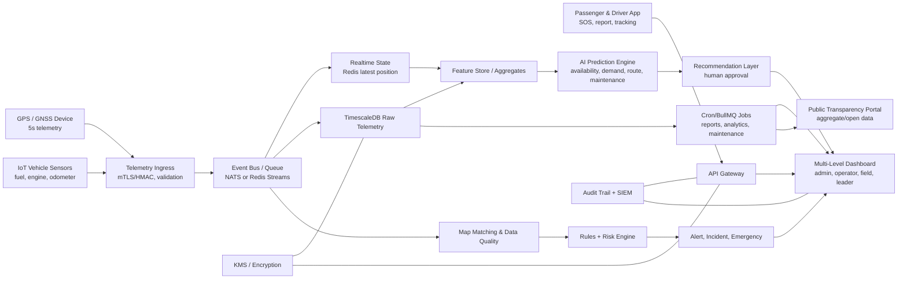

# Advanced Government Monitoring, AI, and Digital Transport Roadmap

**Tujuan:** merancang evolusi Sentra sebagai ekosistem monitoring angkot pemerintah yang real-time, proaktif, prediktif, audit-ready, dan bisa menjadi dasar kebijakan transportasi kota.

**Posisi terhadap roadmap saat ini:** dokumen ini adalah rancangan strategis post-Phase 17. Sistem yang sudah ada tetap menjadi pondasi: telemetry kendaraan, route compliance, anomaly-alert-incident, risk score, public report, passenger mobile, automated review, network view, sanction workflow, heatmap, dan social intelligence.

**Prinsip utama:**

- GPS kendaraan tetap menjadi sumber kebenaran operasional.
- Raw GPS tetap disimpan sebagai bukti; matched GPS dipakai untuk visualisasi dan rules yang lebih stabil.
- AI membantu prediksi, ringkasan, optimasi, dan prioritas investigasi, tetapi tidak menjadi dasar tunggal sanksi atau eskalasi formal.
- Keputusan sanksi, perubahan trayek, dan tindakan lapangan tetap human-in-the-loop oleh Dishub.
- Data masyarakat dan penumpang harus minim, terbatas tujuan, terenkripsi, dan punya kebijakan retensi yang jelas sebelum production.

---

## 1. Sasaran Sistem Pemerintah

Sentra vNext harus menjawab kebutuhan pemerintah pada empat level:

1. **Operasional harian:** posisi angkot, armada aktif, incident aktif, emergency, dan petugas terdekat.
2. **Pengendalian layanan:** kepatuhan trayek, headway, frekuensi rit, ngetem, off-route, overspeed, dan lost signal.
3. **Prediksi dan optimasi:** prediksi ketersediaan angkot, permintaan penumpang, congestion impact, maintenance risk, dan optimasi rute.
4. **Kebijakan publik:** laporan KPI, transparansi layanan, evaluasi izin/trayek, pembinaan owner/driver, dan prioritas investasi transportasi.

Target KPI utama:

| KPI | Target | Definisi ukur |
| --- | ---: | --- |
| Akurasi tracking | >= 99.5% | Persentase ping valid yang lolos validasi timestamp, device auth, akurasi koordinat, dan map-matching tolerance per route. |
| Update interval | 5 detik | Kendaraan aktif mengirim telemetry setiap 5 detik, dengan toleransi network jitter maksimal 2 interval. |
| Latensi dashboard | p95 <= 3 detik | Waktu dari telemetry diterima API sampai marker dashboard berubah. |
| Waktu respon emergency | <= 3 menit | Waktu dari SOS valid diterima sampai operator acknowledge dan petugas/driver/kanal darurat ditugaskan. |
| Efisiensi rute | +25% | Penurunan waktu tempuh, idle/ngetem, deviasi trayek, atau konsumsi BBM per rit dibanding baseline pilot. |
| Kepuasan penumpang | >= 85% | Survey mobile/public portal + penyelesaian laporan + sentiment agregat. |
| Data quality telemetry | >= 98% | Ping dengan device_id valid, vehicle assignment valid, timestamp wajar, dan koordinat di area operasi. |
| Incident SLA compliance | >= 90% | Incident ditangani sesuai SLA kategori dan severity. |

---

## 2. Arsitektur Target

### Komponen inti

| Komponen | Tanggung jawab | Teknologi yang disarankan |
| --- | --- | --- |
| Telemetry ingress | Menerima GPS 5 detik, validasi device, normalisasi payload, deduplikasi | Node.js service saat ini, bisa dipisah saat skala naik |
| Event bus | Menahan lonjakan traffic dan memisah live tracking dari analytics | Redis Streams/BullMQ untuk near-term, NATS JetStream untuk scale kota |
| Realtime state | Last known position, online/offline, marker dashboard | Redis |
| Time-series storage | Raw telemetry dan histori playback | PostgreSQL + PostGIS + TimescaleDB |
| Map matching | Snap GPS ke route resmi, guard false off-route, simpan raw + matched | PostGIS helper awal, OSRM/Valhalla lokal untuk fase scale |
| Rules and risk engine | Ngetem, off-route, wrong direction, overspeed, lost signal, risk score | Rules-first engine existing |
| AI prediction engine | Prediksi availability, demand, maintenance, route optimization | Python worker or Node worker, model registry, feature store |
| Cron/job scheduler | Report, maintenance, analytics, data quality, model retraining | BullMQ Job Scheduler dengan Redis |
| Dashboard API | RBAC, data aggregation, incident, emergency, public report | API gateway existing |
| Public transparency portal | Data publik agregat tanpa PII | Next.js route/page atau portal terpisah |

---

## 3. Sepuluh Modul Sistem

### 3.1 Real-Time Tracking GPS Precision Tinggi

Kebutuhan:

- Telemetry kendaraan aktif setiap 5 detik.
- Setiap payload wajib berisi `vehicle_id` atau `imei_or_serial`, `ts`, `lat`, `lon`, `speed_kmh`, `heading`, `accuracy_m`, dan status operasi.
- Device wajib authenticated memakai mTLS atau HMAC payload signature.
- API menolak timestamp terlalu lama, koordinat di luar area kota, device tidak assigned, dan payload duplikat.
- Realtime state disimpan di Redis untuk dashboard, raw telemetry disimpan di TimescaleDB.
- Matched telemetry disimpan terpisah agar operator melihat jalur yang bersih, tetapi raw telemetry tetap tersedia untuk audit.

Data quality rules:

- `accuracy_m <= 20` untuk GPS yang dianggap high precision.
- Jika `accuracy_m > 50`, data tetap disimpan sebagai raw tetapi tidak langsung memicu anomaly.
- Off-route tidak boleh dipicu dari satu titik, wajib memakai grace window minimal 2-3 telemetry point atau durasi tertentu.
- Device offline dihitung dari interval 5 detik dengan threshold operasional, misalnya 60-180 detik tergantung route dan area sinyal.

### 3.2 AI Prediksi Ketersediaan Angkot

Output AI:

- Prediksi jumlah angkot tersedia per trayek/segmen/stop untuk horizon 5, 15, 30, dan 60 menit.
- ETA headway per stop.
- Risiko kekosongan layanan di segmen tertentu.
- Rekomendasi penambahan armada, redistribusi armada, atau petugas lapangan.

Fitur input:

- Histori telemetry, headway, rit, stop density, ngetem, off-route, lost signal.
- Jam, hari, tanggal merah, jadwal sekolah/kerja.
- Kondisi lalu lintas real-time dari ATCS atau provider traffic jika tersedia.
- Cuaca, event kota, pasar, terminal, sekolah, dan titik keramaian.
- Public report dan social sentiment agregat.

Model:

- Baseline awal: moving average, seasonal naive, gradient boosting.
- Fase lanjut: Temporal Fusion Transformer, LSTM/GRU, atau Prophet-like model per route.
- Model wajib punya fallback rules jika input traffic eksternal gagal.

Governance:

- Simpan model version, training data window, feature list, metric, dan reason code.
- Prediksi menjadi rekomendasi, bukan instruksi otomatis ke driver.
- Akurasi model dievaluasi bulanan dengan MAE/MAPE per trayek dan jam sibuk.

### 3.3 Cron Job dan Otomatisasi

Gunakan BullMQ Job Scheduler karena repo sudah memakai Redis/BullMQ untuk automated review. Scheduler harus idempotent, punya retry, exponential backoff, audit log, dan observability.

| Job | Jadwal | Output |
| --- | --- | --- |
| `report:daily` | Setiap hari 00:15 | KPI harian, rit, SLA, incident, compliance |
| `report:monthly` | Tanggal 1 01:00 | Ringkasan pimpinan, Bappeda, dan kebijakan |
| `maintenance:predictive` | Setiap 6 jam | Kendaraan berisiko maintenance, suhu mesin, kilometer, DTC |
| `analytics:performance` | Setiap 1 jam | Headway, ngetem zone, route efficiency, driver behavior |
| `analytics:demand-forecast` | Setiap 15 menit | Prediksi demand per stop/route |
| `analytics:availability` | Setiap 5 menit | Prediksi ketersediaan armada |
| `data-quality:telemetry` | Setiap 5 menit | Missing ping, invalid device, GPS drift, duplicate payload |
| `ai:model-retrain` | Mingguan atau bulanan | Model baru dengan approval sebelum production |
| `security:audit-export` | Harian | Audit trail sensitif dan anomaly akses |
| `retention:archive` | Harian | Kompresi TimescaleDB dan arsip object storage |

Catatan implementasi:

- Scheduler ID harus stabil agar tidak membuat duplicate recurring job.
- Job berat tidak membaca raw telemetry penuh jika sudah ada tabel agregat.
- Semua output report menyimpan metadata: `job_id`, `started_at`, `finished_at`, `input_window`, `status`, `error`, dan `generated_by`.

### 3.4 Dashboard Multi-Level

Role target:

| Role | Fokus layar | Akses |
| --- | --- | --- |
| `ADMIN` | konfigurasi sistem, integrasi, user, policy, model approval | penuh sesuai audit |
| `ANALISA` | analytics, compliance, heatmap, reports, model insight | data sensitif terbatas dan audited |
| `OPERATOR` | live monitoring, alert, incident, emergency, passenger layer | operasional tanpa master-data sensitif |
| `PETUGAS_LAPANGAN` | tugas lapangan, navigasi ke incident, verifikasi, foto bukti | mobile field app terbatas |
| `PIMPINAN` | KPI, SLA, trend, kebijakan, peta risiko | agregat strategis |
| `PUBLIC_USER` | tracking publik, report, status laporan | data publik aman |

Dashboard utama:

- Command center live map dengan vehicle, passenger emergency, incident, petugas, dan route layer.
- Emergency board dengan SLA timer, nearest responder, escalation channel.
- AI forecast panel: route at risk, headway anomaly, demand spike.
- Fleet health panel: IoT alerts, maintenance due, device tamper.
- Driver behavior panel: overspeed, harsh driving, route adherence, complaint correlation.
- Policy dashboard: KPI bulanan, compliance owner, route service gap, sanction status.

### 3.5 Integrasi IoT Kondisi Kendaraan

Sensor minimum:

- Fuel level atau fuel consumption.
- Engine temperature.
- Odometer/kilometer.
- Battery voltage.
- Power connected/disconnected.
- DTC/error code jika memakai OBD-II/CAN gateway.
- Door/occupancy sensor sebagai fase lanjut jika device tersedia.

Data model tambahan:

- `vehicle_sensor_readings`: telemetry sensor time-series.
- `vehicle_health_latest`: snapshot health terakhir.
- `maintenance_predictions`: prediksi risiko dan rekomendasi jadwal.
- `maintenance_actions`: tindakan owner/Dishub dan bukti.

Rules:

- Engine temperature tinggi berulang -> maintenance alert.
- Fuel drop tidak wajar -> indikasi kebocoran atau fraud.
- Odometer tidak konsisten dengan telemetry distance -> data quality/fraud signal.
- Power disconnect lalu lost signal -> kandidat device tamper.

### 3.6 Emergency Response

Sumber emergency:

- Tombol SOS penumpang di passenger mobile.
- Tombol darurat sopir di driver app atau device panic button.
- Auto-critical dari rules, misalnya crash-like stop, overspeed ekstrem, atau security report.

Alur:

1. SOS masuk dengan lokasi, user/session, route/vehicle terdekat, kategori, dan bukti awal.
2. Sistem validasi rate limit, duplicate, dan trust signal.
3. Incident `EMERGENCY` dibuat dengan severity `CRITICAL`.
4. Operator menerima alarm real-time dengan SLA 3 menit.
5. Sistem merekomendasikan petugas lapangan terdekat, kendaraan terkait, kontak driver/owner, dan kanal eskalasi.
6. Operator acknowledge, assign, dan memulai tindakan.
7. Semua update masuk ke `incident_actions` dan audit log.

SLA:

- p95 operator acknowledge <= 60 detik.
- p95 assign responder <= 180 detik.
- Jika tidak ada acknowledge dalam 60 detik, eskalasi ke supervisor dan notifikasi cadangan.

### 3.7 Optimasi Rute Berbasis Machine Learning

Tujuan optimasi:

- Mengurangi kemacetan.
- Menjaga coverage layanan publik.
- Meningkatkan efisiensi BBM.
- Mengurangi waktu tunggu penumpang.
- Mengurangi bunching atau penumpukan angkot.

Pendekatan:

- Simulasi dulu, bukan langsung mengubah trayek.
- Optimasi segment-level: headway, dispatching, stop recommendation, dan no-stopping zone.
- Model memperhitungkan batas regulasi trayek resmi, terminal, stop, sekolah, pasar, dan titik rawan.
- Rekomendasi harus punya confidence, dampak estimasi, dan data pembanding baseline.

Output:

- Rekomendasi jam operasi dan interval per trayek.
- Rekomendasi stop resmi baru atau zona larangan ngetem.
- Rekomendasi redistribusi armada saat demand spike.
- Rekomendasi perubahan route corridor untuk kajian, bukan otomatis.

### 3.8 Penilaian Performa Sopir Berbasis Behavior Analytics

Driver score harus dipakai untuk pembinaan dan keselamatan, bukan sanksi otomatis.

Sinyal:

- Overspeed terkonfirmasi.
- Harsh braking/acceleration jika sensor mendukung.
- Ngetem di luar zona resmi.
- Off-route dan wrong direction.
- Ketepatan rit dan headway.
- Public report yang terkonfirmasi.
- Emergency handling dan catatan petugas.
- Kepatuhan dokumen SIM/assignment.

Score:

- `safety_score`: perilaku berkendara.
- `service_score`: kepatuhan layanan, laporan masyarakat, headway.
- `compliance_score`: trayek, assignment, dokumen.
- `coaching_priority`: prioritas pembinaan driver.

Guardrail:

- Driver score hanya dihitung jika assignment driver valid.
- Jangan menyimpulkan perilaku driver dari data kendaraan jika driver assignment kosong.
- Score wajib explainable dan bisa diajukan koreksi manual.

### 3.9 Prediksi Permintaan Penumpang Time-Series

Output:

- Demand per stop/route per 15 menit.
- Jam puncak dan segmen rawan kekurangan armada.
- Prediksi load factor jika occupancy data tersedia.
- Demand anomaly, misalnya lonjakan karena event.

Data input:

- Stop density dari telemetry berhenti.
- Passenger tracking agregat dan public app search intent.
- Report kepadatan.
- Kalender sekolah, kantor, event, cuaca.
- Data eksternal seperti ticketing atau sensor okupansi jika tersedia.

Pengukuran:

- MAPE per route dan jam.
- Precision/recall untuk demand spike.
- Dampak operasional: penurunan waiting time dan complaint kepadatan.

### 3.10 Platform Transparansi Publik

Data yang boleh dibuka:

- Status operasi trayek.
- Posisi angkot publik yang aman.
- Headway rata-rata.
- On-time/service availability per route.
- Incident publik yang sudah disanitasi.
- Statistik laporan masyarakat.
- KPI bulanan agregat.
- Open data CSV/API untuk akademisi dan komunitas.

Data yang tidak boleh dibuka:

- Identitas penumpang, pelapor, driver, owner.
- Device IMEI/serial.
- Raw passenger tracking.
- Bukti foto/video laporan.
- Risk score individual jika belum ada dasar kebijakan publik.
- Lokasi petugas lapangan secara real-time.

---

## 4. Security Layer dan Compliance

Security baseline:

- TLS 1.3 untuk semua traffic publik dan internal.
- mTLS atau HMAC signature untuk GPS/IoT device.
- JWT/session rotation untuk aplikasi, refresh token revocation, CSRF untuk cookie-based web.
- Field-level encryption untuk NIK, alamat, dokumen, nomor SIM, nomor rangka/mesin, dan data pelapor.
- Encryption at rest untuk database, backup, dan object storage.
- KMS/HSM untuk key management, rotasi key berkala, dan akses terbatas.
- RBAC + ABAC: role, unit kerja, route ownership, emergency assignment, dan purpose-based access.
- Audit trail immutable untuk akses data sensitif, perubahan rule, model approval, incident action, dan sanction.
- Rate limiting dan abuse detection untuk telemetry publik, public report, login, dan SOS.
- SIEM/log monitoring untuk akses tidak wajar, export besar, login gagal, dan privilege change.
- Data retention policy: raw telemetry, matched telemetry, public report evidence, passenger tracking, audit log, dan AI feature store harus punya masa simpan berbeda.

Regulasi dan rujukan hukum:

- [Permenhub No. 15 Tahun 2019](https://peraturan.bpk.go.id/Details/129467/permenhub-no-15-tahun-2019) tentang penyelenggaraan angkutan orang dengan kendaraan bermotor umum dalam trayek. Dokumen ini relevan untuk trayek, pengawasan, sistem informasi, peran masyarakat, dan sanksi administratif.
- [PP No. 74 Tahun 2014](https://peraturan.bpk.go.id/Details/5516/pp-no-74-tahun-2014) tentang Angkutan Jalan, yang menjadi dasar umum penyelenggaraan angkutan jalan dan telah diubah oleh PP No. 30 Tahun 2021.
- [Permenhub No. 98 Tahun 2013](https://peraturan.bpk.go.id/Details/147747/permenhub-no-98-tahun-2013) dan [Permenhub No. 29 Tahun 2015](https://peraturan.bpk.go.id/Details/103409/permenhub-no-29-tahun-2015) tentang standar pelayanan minimal angkutan orang dalam trayek.
- [UU No. 27 Tahun 2022](https://peraturan.bpk.go.id/Details/229798/uu-no-27-tahun-2022) tentang Pelindungan Data Pribadi.
- [PP No. 71 Tahun 2019](https://peraturan.bpk.go.id/Details/122030/pp-no-71-tahun-2019) tentang Penyelenggaraan Sistem dan Transaksi Elektronik.
- [Perpres No. 95 Tahun 2018](https://peraturan.bpk.go.id/Details/96913/perpres-no-95-tahun-2018) tentang Sistem Pemerintahan Berbasis Elektronik.

Kebijakan internal yang wajib dibuat sebelum production:

- Kebijakan klasifikasi data.
- Kebijakan retensi data GPS, passenger tracking, public report, dan evidence.
- SOP akses data sensitif.
- SOP incident response siber.
- SOP emergency transport response.
- SOP koreksi data dan dispute owner/driver.
- SOP AI model approval dan model rollback.

---

## 5. Uji Coba Bertahap 3 Rute Pilot Selama 6 Bulan

Rute pilot disarankan mengikuti seed/demo yang sudah ada: trayek 01, 02, dan 03. Jika Dishub punya prioritas lapangan berbeda, pilih rute dengan kombinasi demand tinggi, keluhan tinggi, dan variasi kondisi lalu lintas.

### Tahap pra-pilot

- Validasi rute resmi, stop, terminal, base/pool, dan geofence.
- Pasang device GPS/IoT pada armada pilot.
- Verifikasi owner, driver, vehicle, device, assignment.
- Latih operator, analisa, petugas lapangan, dan supervisor.
- Tetapkan baseline KPI minimal 2-4 minggu sebelum intervensi.

### Timeline 6 bulan

| Bulan | Fokus | Keluaran |
| --- | --- | --- |
| 0 | Persiapan | master data final, device installed, SOP, dashboard ready, data baseline |
| 1 | Tracking 5 detik | akurasi tracking, uptime device, latency dashboard, data quality report |
| 2 | Rules dan incident | ngetem/off-route/lost-signal/overspeed stabil, operator action SLA |
| 3 | Public report dan emergency | SOS pilot, public report review, emergency SLA <= 3 menit |
| 4 | AI forecast beta | prediksi availability dan demand per route, evaluasi model awal |
| 5 | Route optimization simulation | rekomendasi dispatch/headway/zona ngetem, belum mengubah trayek resmi |
| 6 | Evaluasi dan scale decision | laporan KPI, biaya aktual, policy gap, rekomendasi perluasan |

Evaluasi bulanan:

- Review KPI target vs aktual.
- Review false positive anomaly.
- Review emergency drill dan response time.
- Review complaint masyarakat dan driver/owner feedback.
- Review biaya cloud, device, connectivity.
- Review compliance PDP dan audit log.
- Rekomendasi tindakan bulan berikutnya.

Kriteria pilot berhasil:

- Tracking valid >= 99.5% untuk kendaraan dengan device sehat.
- Dashboard latency p95 <= 3 detik.
- Emergency drill p95 assign responder <= 3 menit.
- Penurunan ngetem/off-route/lost signal minimal 15% pada bulan 6.
- Route efficiency membaik menuju target 25% pada koridor yang diberi intervensi.
- Kepuasan penumpang >= 85% pada survey pilot.
- Operator dan Analisa memakai dashboard sebagai sumber kerja harian, bukan hanya demo.

---

## 6. Sepuluh Langkah Pengembangan ke Depan

1. **Standarisasi data dan perangkat.** Tetapkan standar GPS/IoT, payload, interval 5 detik, device auth, dan SLA vendor dalam dokumen pengadaan serta izin operasional.
2. **Data quality command center.** Tambahkan dashboard kualitas data, missing telemetry, GPS drift, device tamper, dan assignment mismatch sebelum mengandalkan AI.
3. **Emergency response center.** Jadikan SOS sebagai workflow formal dengan SLA, escalation matrix, petugas lapangan, dan drill berkala.
4. **AI availability forecast.** Bangun prediksi ketersediaan angkot per trayek/stop dengan fallback rules dan evaluasi bulanan.
5. **Demand forecasting.** Tambahkan model time-series untuk demand penumpang dan hubungkan ke rekomendasi dispatching.
6. **Predictive maintenance.** Integrasikan IoT health, odometer, KIR/STNK/SIM, dan maintenance scheduling berbasis risiko.
7. **Route optimization simulation.** Jalankan optimasi berbasis ML dalam mode simulasi dan rekomendasi, bukan perubahan otomatis.
8. **Driver and owner coaching.** Gunakan behavior analytics untuk pembinaan, insentif, dan prioritas pemeriksaan, tetap human-reviewed.
9. **Public transparency portal.** Publikasikan data agregat layanan, KPI, status route, dan open data yang sudah disanitasi.
10. **Integrated urban mobility intelligence.** Integrasikan ATCS, cuaca, event kota, Bappeda, kepolisian, call center, dan sistem perizinan untuk kebijakan transportasi berbasis bukti.

---

## 7. Kebijakan Transportasi yang Perlu Direvisi

| Kebijakan | Revisi yang disarankan | Dampak |
| --- | --- | --- |
| Izin operasional angkot | Wajib device GPS/IoT tersertifikasi, assignment aktif, dan data sharing ke Dishub | Data monitoring menjadi syarat layanan resmi |
| Standar pelayanan minimal lokal | Tambahkan KPI digital: headway, tracking uptime, response time, complaint resolution, route adherence | SPM lebih terukur dan audit-ready |
| SOP emergency transport | Definisikan kategori SOS, SLA 3 menit, chain of command, kanal ke petugas dan kepolisian | Response lebih cepat dan seragam |
| Kebijakan data pribadi | Tetapkan klasifikasi data, retensi, persetujuan, akses, audit, dan hak subjek data | Compliance PDP dan trust publik |
| Kebijakan sanksi | Tegaskan risk score/AI sebagai evidence pendukung, bukan keputusan otomatis | Mengurangi risiko salah sanksi |
| Kebijakan pembinaan driver/owner | Skema coaching, peringatan, insentif, dan evaluasi berkala berbasis evidence | Perbaikan perilaku tanpa langsung represif |
| Kebijakan trayek dinamis | Buat mekanisme kajian perubahan stop/headway/koridor dari data pilot dan public hearing | Optimasi layanan tetap sah dan partisipatif |
| Pengadaan vendor GPS/IoT | SLA uptime, akurasi, security, data ownership, API portability, penalty, dan exit plan | Mengurangi vendor lock-in |
| Transparansi publik | Open data agregat, dashboard publik, dan status laporan tanpa PII | Meningkatkan kepercayaan masyarakat |
| Integrasi lintas instansi | MoU Dishub, Diskominfo, Bappeda, kepolisian, call center, dan operator/koperasi | Data tidak terfragmentasi |
| Retensi evidence | Masa simpan raw telemetry, matched telemetry, attachment, audit log, dan passenger tracking | Menjaga bukti tanpa over-collection |
| AI governance | Model approval, explainability, bias review, rollback, dan audit model | AI bisa dipertanggungjawabkan |

---

## 8. Anggaran Operasional 5 Tahun

Asumsi kasar:

- Kurs perencanaan: Rp16.000 per USD.
- Tahun 1 adalah pilot 3 rute dengan 100-150 kendaraan.
- Tahun 2 memperluas ke 500-1.000 kendaraan.
- Tahun 3 menuju 2.000-3.000 kendaraan.
- Tahun 4-5 siap skala kota sampai 5.000 kendaraan.
- Angka ini adalah planning range, bukan HPS atau quotation vendor.

Komponen biaya:

- Pengembangan platform dan integrasi.
- Cloud/infra, database, observability, backup.
- GPS/IoT device, instalasi, replacement unit.
- SIM/data connectivity perangkat.
- Command center, pelatihan, SOP, change management.
- Keamanan siber, audit, compliance, penetration test.
- AI/model ops, data engineering, dan evaluasi model.
- Public outreach dan survey kepuasan.

| Tahun | Skala | Estimasi per tahun | Fokus belanja |
| --- | --- | ---: | --- |
| 1 | Pilot 3 rute, 100-150 kendaraan | Rp3-5 miliar | platform hardening, device pilot, command center kecil, emergency SOP, baseline AI |
| 2 | 500-1.000 kendaraan | Rp6-10 miliar | perluasan device, connectivity, field app, reporting pimpinan, data quality center |
| 3 | 2.000-3.000 kendaraan | Rp9-16 miliar | IoT health, AI demand/availability, predictive maintenance, HA infra |
| 4 | sampai 5.000 kendaraan | Rp12-25 miliar | scale kota, public transparency, route optimization simulation, security maturity |
| 5 | optimasi kota penuh | Rp10-22 miliar | efisiensi layanan, model refinement, integrasi ATCS/Bappeda, audit berkala |

Catatan cloud dari dokumen estimasi repo:

- Pilot kecil: sekitar USD 270-670 per bulan untuk infra.
- Menengah: sekitar USD 1.080-2.750 per bulan.
- Skala kota: sekitar USD 4.900-14.700 per bulan.

Biaya terbesar pada production bukan hanya cloud, tetapi perangkat, connectivity, support operasional, keamanan, dan perubahan proses kerja pemerintah.

---

## 9. Roadmap Digitalisasi Transportasi Umum Kota

### Phase 18 - Precision Tracking and Data Quality

- Interval GPS 5 detik untuk pilot.
- Device auth mTLS/HMAC.
- Data quality dashboard.
- Raw + matched telemetry.
- SLA tracking >= 99.5%.

### Phase 19 - Emergency Response and Field Operations

- SOS passenger dan driver.
- Emergency board operator.
- Petugas lapangan mobile workflow.
- SLA <= 3 menit dengan escalation matrix.
- Emergency drill bulanan.

### Phase 20 - AI Availability and Demand Forecasting

- Feature store.
- Forecast availability per route/stop.
- Forecast demand per 15 menit.
- Model metrics dan model registry.
- Explainable forecast panel.

### Phase 21 - IoT Vehicle Health and Predictive Maintenance

- Fuel, engine temperature, odometer, battery, power, DTC.
- Maintenance risk score.
- Maintenance schedule automation.
- Owner compliance dashboard.

### Phase 22 - ML Route Optimization Simulation

- Headway and dispatch recommendation.
- No-stopping/ngetem zone recommendation.
- Fuel and congestion efficiency simulation.
- Policy review workflow sebelum perubahan route.

### Phase 23 - Public Transparency and Open Data

- Public KPI portal.
- Sanitized route performance.
- Public report status.
- Open data aggregate.
- Public satisfaction feedback loop.

---

## 10. Risiko dan Mitigasi

| Risiko | Dampak | Mitigasi |
| --- | --- | --- |
| GPS noise dan blank spot | false off-route/lost signal | map matching, grace window, raw/matched separation, device health |
| Vendor lock-in GPS/IoT | biaya naik, integrasi sulit | standar payload, API portability, data ownership clause |
| Over-collection data penumpang | risiko PDP dan trust publik | minimisasi data, retensi jelas, akses terbatas, audit |
| AI dijadikan keputusan otomatis | risiko sanksi salah | human-in-loop, rules-first, explainability, model approval |
| Operator overload alert | alert fatigue | severity tuning, deduplication, incident threshold |
| Biaya telemetry 5 detik membengkak | cloud dan storage tinggi | Timescale compression, retention, summary tables, archive |
| Resistance owner/driver | adoption lambat | sosialisasi, pembinaan, insentif, masa transisi |
| Emergency abuse/spam | response terganggu | rate limit, trust score, duplicate detection, manual override |
| Data antar instansi tidak sinkron | kebijakan lemah | MoU, data steward, master data governance |

---

## 11. Definition of Done Strategis

Sistem dapat disebut siap scale jika:

- Pilot 6 bulan selesai dengan laporan bulanan lengkap.
- KPI utama tercapai atau gap-nya punya rencana koreksi yang jelas.
- Semua data sensitif punya RBAC, audit log, dan retensi.
- Emergency response pernah diuji dengan drill dan memenuhi SLA.
- AI forecast sudah punya baseline, metric, dan fallback.
- Public transparency portal hanya membuka data agregat yang aman.
- Kebijakan izin, SPM lokal, data, emergency, dan sanksi sudah direvisi atau minimal masuk proses legal/pemerintahan.
- Anggaran tahun berikutnya didasarkan pada biaya aktual pilot, bukan asumsi awal.
