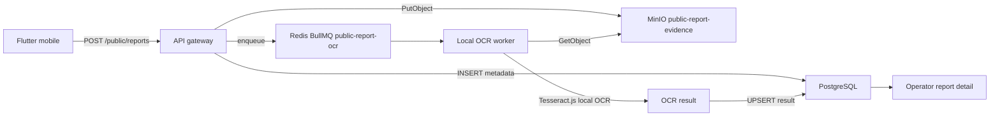

# Public Report Local OCR Design

## Status

Approved on 2026-05-31.

## Goal

Tambahkan OCR plat nomor sebagai bantuan review laporan warga. OCR memproses foto
bukti yang sudah tersimpan di MinIO secara asynchronous melalui worker lokal
Docker. Foto tidak dikirim ke layanan OCR eksternal.

OCR hanya menambah evidence untuk operator. OCR tidak mengubah
`plate_match_status`, tidak membuat incident, dan tidak memicu sanksi otomatis.

## Architecture

## Components

### API Gateway

Setelah laporan dan attachment berhasil disimpan, API gateway enqueue satu job
OCR per attachment. Upload laporan tetap mengembalikan response tanpa menunggu
OCR selesai.

### OCR Worker

Worker berjalan sebagai service Docker terpisah dan memakai BullMQ queue
`public-report-ocr`. Worker:

1. menandai result `PROCESSING`;
2. mengambil attachment dari MinIO;
3. menjalankan Tesseract.js lokal dengan bahasa `eng`;
4. membatasi karakter ke `A-Z0-9`;
5. mengekstrak kandidat plat Indonesia;
6. membandingkan kandidat dengan input manual warga;
7. menyimpan hasil akhir.

Satu instance Tesseract worker dipakai ulang untuk beberapa job dan dihentikan
gracefully saat proses berhenti. Traineddata memakai cache lokal Docker agar
worker tidak mengunduh data bahasa pada setiap job.

### Object Storage

Foto tetap disimpan di bucket `public-report-evidence`. Worker membaca file
melalui object key yang tersimpan di `public_report_attachments`. PostgreSQL
menyimpan metadata dan hasil OCR, bukan binary gambar.

## Data Model

Tambahkan tabel `public_report_ocr_results`:

| Column | Type | Notes |
| --- | --- | --- |
| `ocr_result_id` | `uuid` | Primary key |
| `public_report_id` | `uuid` | FK ke laporan |
| `attachment_id` | `uuid` | FK ke attachment, unique |
| `status` | `text` | `PENDING`, `PROCESSING`, `COMPLETED`, `FAILED` |
| `comparison_result` | `text` | `OCR_MATCHED`, `OCR_MISMATCHED`, `NEEDS_OPERATOR_REVIEW` |
| `raw_text` | `text` | Output OCR mentah |
| `normalized_plate_candidate` | `text` | Kandidat plat setelah normalisasi |
| `confidence_score` | `numeric` | Rentang `0..1` |
| `error_message` | `text` | Pesan internal bila gagal |
| `created_at` | `timestamptz` | Waktu dibuat |
| `started_at` | `timestamptz` | Waktu proses dimulai |
| `completed_at` | `timestamptz` | Waktu proses selesai |
| `updated_at` | `timestamptz` | Waktu pembaruan |

## Evaluation Rules

Ambang confidence awal adalah `0.90`.

| Condition | Result |
| --- | --- |
| Candidate terbaca, confidence `>= 0.90`, sama dengan input warga | `OCR_MATCHED` |
| Candidate terbaca, confidence `>= 0.90`, berbeda dengan input warga | `OCR_MISMATCHED` |
| Confidence `< 0.90`, kandidat tidak terbaca, atau OCR gagal | `NEEDS_OPERATOR_REVIEW` |

Perbandingan memakai normalisasi alfanumerik uppercase. Contoh:
`F-1234-BO`, `F 1234 BO`, dan `f1234bo` dibandingkan sebagai `F1234BO`.

## Operator Experience

Detail laporan operator menampilkan:

- foto attachment;
- plat input warga;
- raw OCR text;
- kandidat plat ternormalisasi;
- confidence score;
- status OCR;
- comparison result.

`NEEDS_OPERATOR_REVIEW` harus terlihat jelas. Operator tetap mengambil keputusan
akhir berdasarkan foto, telemetry, dan evidence lain.

## Error Handling

- Kegagalan MinIO atau OCR menandai row `FAILED` dengan
  `NEEDS_OPERATOR_REVIEW`.
- Job BullMQ memakai retry terbatas dengan exponential backoff.
- Upload laporan tetap sukses bila enqueue OCR gagal; API mencatat error dan
  result tetap dapat diproses ulang.
- Worker tidak mengekspos stack trace kepada pengguna mobile.

## Security And Privacy

- Foto tidak dikirim ke layanan eksternal.
- Attachment tetap hanya dapat dibaca operator atau analis melalui API gateway
  setelah pemeriksaan role.
- Hasil OCR mengikuti retensi bukti laporan Dishub.
- OCR tidak menjadi satu-satunya dasar eskalasi incident atau sanksi.

## Testing

- Unit test normalisasi dan ekstraksi kandidat plat.
- Unit test threshold `0.90`.
- Contract test migration dan queue wiring.
- Worker test untuk `OCR_MATCHED`, `OCR_MISMATCHED`, confidence rendah, gambar
  tanpa plat, dan kegagalan MinIO.
- Smoke test Docker: upload attachment ke MinIO, tunggu worker, verifikasi row
  OCR serta endpoint detail operator.

## Rollout

1. Aktifkan di staging dengan concurrency rendah.
2. Evaluasi akurasi pada foto angkot nyata Kota Bogor.
3. Ukur completion rate, processing latency, dan mismatch rate.
4. Tuning preprocessing dan pola kandidat setelah pilot.
5. Pertahankan manual operator review untuk seluruh hasil OCR.
